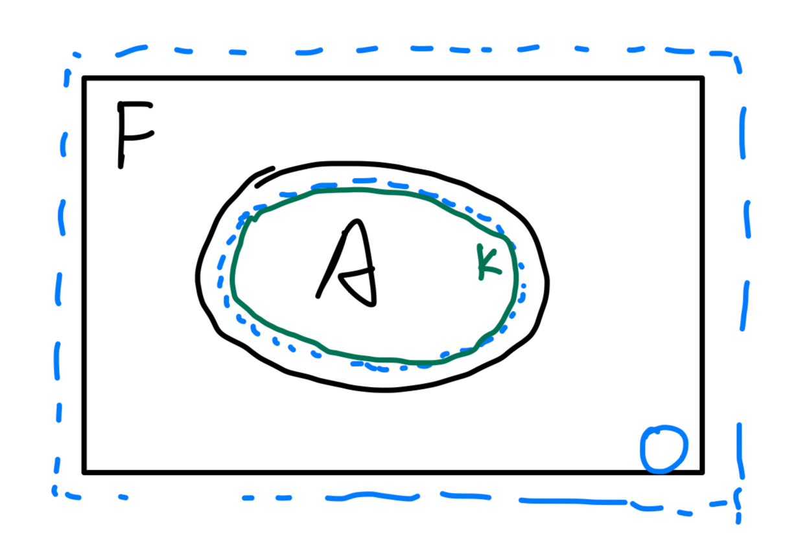

# Measure on $\R^n$ {#realMeasures}

This section establishes the base case of the Lebesgue 
measure on $\R^n$: 

1. [Exterior measure](#extMeasure): foundational properties of the exterior 
    measure and interaction with rectangles. 
2. [Lebesgue measure and Borel regularity](#lebMeasure): 
    definition and relation with Borel sets, 
    characterization of measurable sets, example of a non-measurable set. 
3. [Measurable functions](#realMeasurableFunctions): .

Key takeaways: 

1. The exterior measure is the natural outer-measure extension of rectangle volume that 
    satisfies _monotonicity_, _countable subadditivity_, 
    and agrees with our initial definition. 
2. The Lebesgue measure is the Carathéodory restriction of the exterior measure. 
3. Rectangles are measurable (proposition \@ref(prp:rectangleMeasurable)), 
        so Borel sets are measurable since they 
        are freely-generated by rectangles. 
4. The exterior measure (rectangle cover infimum) 
    is equivalent to open cover infimum, and on measurable sets equivalent 
    to compact subset supremum. 
5. A set is measurable iff 
    - it can be upper-approximated by an open cover 
    or lower-approximated by a closed subset up to arbitrarily small but 
    finite measure \@ref(thm:squeezeMeasurable). 
    - it can be approximated by a Borel set up 
    to zero measure \@ref(thm:borelApprox). 

## Rectangles, exterior measure {#extMeasure -}

:::{.definition name="exterior measure"}
The exterior measure $\mu_*(E)$ of any subset $E\subset \R^n$ is 
\[ 
    \mu_*(E) = \inf \sum_{j=1}^\infty |R_j|
\] 
where the $\inf$ is over all countable coverings of $E$ by 
closed rectangles, the measure of a closed rectangle 
$R_j = \prod_{j=1}^n [a_j, b_j]$ is $|Q_j| = \prod_{j=1}^n (b_j - a_j)$. 
:::

:::{.proposition}
The exterior is an outer measure per definition \@ref(def:defOuterMeasure). 

- $E_1\subset E_2\implies \mu_*(E_1)\leq \mu_*(E_2)$. 
- $E=\bigcup_{j=1}^\infty E_j\implies \mu_*(E)\leq \sum_{j=1}^\infty \mu_*(E_j)$. 
:::
<details>
<summary>Proof</summary>
To prove monotonicity, every covering of $E_2$ by a countable set of cubes 
is also a covering of $E_1$. 
For countable subadditivity, the main idea is to construct increasingly 
tight covers such that the countable union of 
these covers is still finitely tight. 
Assume the nontrivial case $\mu_*(E_j)<\infty$. 
For every $\epsilon>0$, we can construct for each $j$ a covering 
\[ 
    E_j\subset \bigcup_{k=1}^\infty R_{k, j}, \quad 
    \sum_{k=1}^\infty |R_{k, j}| \leq \mu_*(E_j) + \df{\epsilon}{2^j}
\] 
The increasingly tight bound ensures that 
\begin{align}
    \mu_*(E) 
    &\leq \sum_{j, k}|R_{k, j}| \leq \sum_{j=1}^\infty \mu_*(E_j) + \df \epsilon {2^j} 
    = \sum_{j=1}^\infty \mu_*(E_j)+\epsilon
\end{align}
</details>

:::{.proposition #openCoverInfimum name="equivalence with open cover infimum"}
Given $E\subset \R^n$, $\mu_*(E)=\inf \mu_*(\mca O)$, where $\inf$ is 
over all open sets $\mca O$ covering $E$. 
:::
<details>
<summary>Proof</summary>
$\mu_*(E)\leq \inf \mu_*(\mca O)$ holds by monotonicity. 
For the other direction, choose cubes $R_j$ covering $E$ 
with margin $\epsilon/2$, and for each cube choose open cube 
$O_j$ covering $R_j$ with margin $\epsilon/2^{j+1}$, then $(O_j)$ 
cover $E$ with margin $\epsilon$. 
</details>

Given a countable set $R_j$ of disjoint rectangles, it is 
intuitive (and easy to show that) 
\[ 
    \mu_*\bigsqcup_{j=1}^\infty R_j = \sum_{j=1}^\infty \mu_*(R_j)
\] 
This is our base case for establishing measurability later on. 

The following proposition is the main reason why we chose closed 
rectangles (instead of open, though they are effectively the same) 
as the basic measurable sets. 

:::{.proposition #finiteDistanceAdditivity name="additivity with finite distance"}
If $E=E_1\cup E_2$ and $d(E_1, E_2)>0$, then 
\[ 
    \mu_*(E) = \mu_*(E_1)+\mu_*(E_2) 
\] 
:::
<details>
<summary>Proof</summary>
By subadditivity, $\mu_*(E)\leq \mu_*(E_1)+\mu_*(E_2)$. 
To show the converse, select $0<\delta < d(E_1, E_2)$ and 
choose a cover $(Q_j)$ of $E$ by closed cubes with margin $\epsilon$. 
Subdivide $(Q_j)$ so that each has size less than $\delta$, so 
that each cube intersects at most one of $E_1, E_2$. Denote by 
$J_1, J_2$ the indices for which $Q_j$ intersects $E_1, E_2$, then 
$E_1, E_2$ are covered by $Q_{J_1}, Q_{J_2}$ respectively. 
</details>

:::{.corollary #almostDisjointAdditivity name="additivity of almost-disjoint rectangles"}
The exterior measure is additive on 
countable collections of almost-disjoint rectangles $R_j\in \mbb R^d$. 
:::
<details>
<summary>Proof</summary>
Give $\epsilon>0$, shrink rectangle $j$ by $\epsilon/2^j$ so they 
are closed sets with finite distance, then invoke additivity through 
proposition \@ref(prp:finiteDistanceAdditivity). 
</details>


:::{.proposition #rectangleMeasurable name="Carathéodory criteria for rectangles"}
Given a rectangle $\subset \R^n$, 
\[ 
    \mu_*(\forall E\subset \R^n) = \mu_*(E\cap R)+ \mu_*(E\cap R^c)
\] 
:::
<details>
<summary>Proof</summary>
To prove the nontrivial direction 
$\mu_*(E\cap R)+ \mu_*(E\cap R^c)\leq \mu_*(\forall E\subset \R^n)$, 
choose an $\epsilon$-cover $R_j$ of $E$, then 
rectang-ify $R_j$ into $R^1_j, R^2_j$ covering 
$E\cap R, E\cap R^c$ respectively and invoke corollary 
\@ref(cor:almostDisjointAdditivity). This shows that 
\[ 
    \mu_*(E\cap R)+ \mu_*(E\cap R^c)
    \leq \mu_*(\forall E\subset \R^n) + \epsilon, \quad \forall \epsilon>0 
\] 
</details>

<span style="color:green">
Boundaries to not always have nontrivial measures
(e.g. $\mbb Q\cap [0, 1]$). There are even 
boundaries of closed sets which have nontrivial measure 
(e.g. fat Cantor set). 
</span>


## Lebesgue measure, Borel regularity {#lebMeasure -}

:::{.definition name="Lebesgue measure"}
The set $\mca L\subset \R^n$ of Lebesgue measurable sets 
are the Carathéodory-measurable sets of the exterior measure: 
\[ 
    S\in \mca L \iff \mu(\forall E\subset \R^n) = \mu(E\cap S)+\mu(E\cap S^c)
\] 
:::

Note that one direction in the Carathéodory criterion always holds: 
\[ 
    \mu(E) \leq \mu(E\cap B) + \mu(E\cap B^c)
\] 

:::{.proposition name="null sets are measurable"}
$\mu(E\subset \R^n)=0\implies E\in \mca L$. 
:::
<details>
<summary>Proof</summary>
To show the nontrivial direction, $\mu(E\cap B)\leq \mu(E)=0$, then 
$\mu(E\cap B^c) \leq \mu(E)$ by subadditivity. 
</details>

:::{.definition name="Borel sets"}
The Borel set $\mca B\subset 2^{R^n}$ is the $\sigma$-algebra 
freely generated by rectangles. 
:::

:::{.theorem name="Borel sets are Lebesgue measurable"}
$\mca B\subset \mca L$. 
:::
_Proof:_ Proposition \@ref(prp:rectangleMeasurable) states that rectangles 
are measurable; invoking the machinery we built in the section 
on the [Carathéodory theorem](#caratheodory) we obtain that 
the elements of the $\sigma$-algebra freely generated by rectangles (Borel subsets) 
are measurable. 

### A non-measurable set {-}

Write $x\sim y$ if $x-y$ is rational and let $\mca E_\alpha$ 
be the equivalence class of $\alpha$. Then 
$[0, 1]=\bigcup \mca E_\alpha$ and construct 
$\mca N$ by choosing one element $x_\alpha$ from 
each $\mca E_\alpha$. 

:::{.proposition} 
$\mca N$ is not measurable.
:::
_Proof:_ Assume $\mca N$ measurable and let 
$\{r_k\}_{k=1}^\infty$ be an enumeration of all rationals 
in $[-1, 1]$ and consider $\mca N_k = \mca N + r_k$. Then 
all $\{\mca N_k\}$ are disjoint. Note that 
\[ 
    [0, 1] \subset \bigsqcup_{k=1}^\infty \mca N_k \subset [-1, 2]
\] 
Assuming measurability (contradiction!), we have 
\[ 
    1\leq \sum_{k=1}^\infty \mu(\mca N_k) \leq 3 
\] 
Every term in the sum is equal, but there is no real number 
which satisfies the construction above; contradiction: 
there cannot be a disjoint-additive function on the disjoint 
countable collection $\{\mca N_k\}$. 

### Approximation of measurable sets {-}

We have seen that the exterior measure is equivalent to open cover infinum 
\@ref(prp:openCoverInfimum). We also have 

:::{.proposition #measurableCompactSupremum name="compact subset supremum"}
If $A$ is Lebesgue measurable, then 
\[ 
    \mu(A) = \sup_{K\subset A\text{ compact}} \mu(K)
\] 
:::
<details>
<summary>Proof</summary>
The trivial direction is $\sup_{K\subset A\text{ compact}} \mu(K) \leq \mu(A)$. 
We wish to show, $\forall \epsilon>0$, that 
\[ 
    \exists K\subset A\text{ compact}: \mu(K) + \epsilon \geq \mu(A)
\] 

```{r echo=FALSE, fig.align='center', out.width='80%', fig.cap="$A$ bounded"}
   
```

1. First suppose $A$ bounded; consider compact $F\supset A$, 
    then there is an open set $G\supset F-A$ which $\epsilon$-approximates
    $F-A$, then $K=A\cap O^c$ is a compact sub-$\epsilon$ subset approximation 
    of $A$. 
    - $K$ must be compact, else $F\subset K\cup O$ will not be compact. 
2. $A$ unbounded: we can construct for each $j\in \mbb N$ 
    an $\epsilon$-approximation of $A_j = A\cap \overline{B_j(0)}$ 
    with $A_j\to A\implies \mu(A_j)\to \mu(A)$. 
</details>

:::{.theorem #openCoverMeasureApprox name="measurability by open cover approximation"}
$A\subset \R^n$ is Lebesgue measurable iff $\forall \epsilon>0$, 
there exists $G\supset A$ such that 
\[ 
    \mu_*(G - A) < \epsilon 
\] 
:::
<details>
<summary>Proof</summary>
Given $A$ measurable, the result follows from open cover 
infimum proposition \@ref(prp:openCoverInfimum). 
Conversely, suppose $A\subset \R^n$ satisfies the conditions 
in the theorem, then choose an $\epsilon$-cover $G\supset A$. 
Note that 
\[ 
    E\cap A^c = E\cap G^c + E\cap (G-A)
\] 
Directly verify the Carathéodory criterion: we use the 
measurability of $G$ and subadditivity 
\begin{align}
    \mu_*(E\cap A) + \mu_*(E\cap A^c) 
    &= \mu_*(E\cap A) + \mu_*(E\cap A^c)  \\ 
    &\leq \mu_*(E\cap G) + \mu_*(E\cap G^c) + \mu_*(E\cap (G-A)) \\ 
    &\leq \mu_*(E\cap G) + \mu_*(E\cap G^c) + \mu_*(G-A)_{< \epsilon} \\ 
    &< \mu_*(E\cap G) + \mu_*(E\cap G^c) + \epsilon 
    = \mu_*(E\cap G) + \epsilon
\end{align}
</details>

:::{.theorem #squeezeMeasurable name="measurability by squeezing"}
$A\subset \R^n$ is Lebesgue measurable iff $\forall \epsilon>0$, 
there exists open $G$, closed $F$, with $F\subset A\subset G$ such that 
$\mu_*(G - F) < \epsilon$. 
:::
_Proof:_ If $A$ satisfies the theorem conditions, then 
$\mu_*(G - A) \leq \mu_*(G - F)<\epsilon$ so $A$ is measurable 
by theorem \@ref(thm:openCoverMeasureApprox). 
Conversely, given $A$ measurable, by theorem \@ref(thm:openCoverMeasureApprox) 
choose $\epsilon/2$-covers of both $A$ and $A^c$. 

:::{.theorem #borelApprox name="measurability by Borel approximation"}
$A\subset \R^n$ is Lebesgue measurable iff there 
exists Borel sets $G, F$ with $F\subset A\subset G$ such that 
\[ 
    \mu(G - A) = \mu(A - F) = 0
\] 
:::
_Proof:_ By theorem \@ref(thm:squeezeMeasurable), construct for each 
$k\in \mbb N$ sets $G_k, F_k$ which $1/k$-squeeze $G$, then 
$G=\bigcap G_k, F=\bigcup F_k$ proves the theorem. 


## Measurable functions on $\R^n$ {#realMeasurableFunctions -}
:::{.proposition name="measurable function"}
Given a measurable space $(\Omega, \Sigma)$. A function 
$\Omega\to \R^n$ is $\Sigma$-measurable if 
$f^{-1}(B) \in \Sigma$ 
for every Borel set $B\subset \R^n$. 
:::

:::{.example}
If $\Sigma=\{\emptyset, \Omega\}$, then the only $\Sigma$-measurable 
functions from $\Omega\to \R^n$ are constant functions. On the 
other extreme, if $\Sigma=2^\Omega$, then every function is measurable. 
For a nontrivial example, if $\Sigma=\{\emptyset, (-\infty, 0), [0, \infty), \R\}$ 
then $f:\R\to \R$ is measurable iff it is 
constant on $(-\infty, 0), [0, \infty)$. 
:::

:::{.definition name="characteristic function"}
Given $E\subset \Omega$, the characteristic function $\chi_E:\Omega\to \R$ is 
\[ 
    \chi_E(x) = \begin{cases}
        1 & x\in E \\ 
        0 & x\notin E
    \end{cases}
\] 
:::

:::{.proposition name="property of characteristic function"}
Given $(\Omega, \Sigma), E\subset \Omega$, then $\chi_E$ is $\Sigma$-measurable 
iff $E\in \Sigma$. 
:::
_Proof:_ 
$\chi_E^{-1}(B) = \{E, \Omega-E, \Omega, \emptyset\}$ 
depending on how $B\subset \R$ intersects with $\{0, 1\}$. 

:::{.proposition name="continuity implies Borel measurability"}
Every continuous function $f:\Omega\to \R^n$ defined on 
a Borel subset $\Omega\subset \R^m$ is a Borel-measurable function. 
:::
_Proof:_ Consider the preimage of $x>a$ ($x, a\in \R^n$ and inequality 
holds elementwise). For any such $a$, consider 
\[ 
    f^{-1}(x>a) 
    = \left[\bigcup_{x\in f^{-1}(x>a)} (x-\delta_x, x+\delta_x) \right]\cap \Omega
\] 
Given every $x\in \R^m: f(x)>a$, by continuity $\exists \delta_x\in \R$ 
such that $f((x-\delta_x, x+\delta_x))>a$. The term in the paranthesis 
is an open set, hence its intersection with the Borel set $\Omega$ is Borel. 

$f:(\Omega\subset \R)\to \R$ is increasing if $x < y\implies f(x)\leq f(y)$; 
it is monotonic if $f$ or $-f$ is increasing. 

:::{.proposition}
if $f:\Omega\to \R$ is monotonic and $\Omega$ is Borel, then $f$ is measurable. 
:::
_Proof:_ Fix $a\in \R$, then for $b=\inf f^{-1}((a, \infty))$, 
monotonicity implies 
\[ 
    f^{-1}((a, \infty)) = (b, \infty)\cap \Omega 
    \text{ or }
    [b, \infty)\cap \Omega
\] 

:::{.proposition name="preservation of measurability under limits"}
Suppose $\{f_j\}\to f:(\Omega, \Sigma)\to \R^n$ point-wise each $f_j$ 
is $\Sigma$-measurable, then $f$ is $\Sigma$-measurable. 
:::
_Proof:_ Unrolling the definition of the limit: for any 
$x\in \Omega, a\in \R^n$, $f(x)>a$ iff 
\begin{align}
    & \lim_{k\to \infty} f_k(x) > a \\ 
    \iff & \exists j>0, \exists N: f_{\forall k>N}(x)>a+1/j \\ 
    \iff & x\in \bigcup_{j=1}^\infty 
        \bigcup_{N=1}^\infty 
        \bigcap_{k=1}^\infty f_k^{-1}(y>a+1/j)
\end{align}
Note that we only need some $j$ to exist. Each $\exists$ translates 
to $\bigcup$, and each $\forall$ translates to $\bigcap$. Then 
the preimage of $y>a$ the measurable set above. 

:::{.definition name="extended Borel"}
$A\subset [-\infty \infty]$ is a Borel set if $A\cap \R$ is Borel. 
Extended measurability is defined similarly. 
:::

:::{.theorem name="variational limits are measurable"}
Given measurable $\{f_k: (\Omega, \Sigma)\to \R\}$, the following functions 
are also measurable: 
\[ 
    g(x) = \inf_k f_k(x), \quad h(x) = \sup_k f_k(x)
\] 
:::
_Proof:_ It suffices to verify for the $\sup$ case that 
\begin{align}
    h(x) > a &\implies \exists k: f_k(x) > a \\ 
    h^{-1}((a, \infty]) &= \bigcup_{k=1}^\infty f_k^{-1}((a, \infty])
\end{align} 

:::{.proposition name="a.e. measurability"}
Given $f$ measurable and $f=g$ a.e. (they differ on a set of 
measure $0$ on the domain), then $g$ is measurable. 
:::
_Proof:_ Let $\{\mca A\}$ be a subbasis generating the measurable  
sets, then $\forall A\in \mca A$, the symmetric difference of 
pre-images $f^{-1}(A), g^{-1}(A)$ is dominated by a set of 
measure $0$; by measurability $g^{-1}(A)$ is measurable, 
so $f^{-1}(S)$ is also measurable. 

Some notations are convenient: 

:::{.definition #setSequenceNotation name="sequence of sets"}
An increasing sequence of sets $\{A_n\}$ is a sequence 
\[ 
    A_1\subset A_2\subset \cdots \to A = \bigcup_{n=1}^\infty A_n
\] 
also written $A_j\nearrow A$. Similarly, a decreasing 
sequence of sets is written $A_j\searrow A$. 
\[ 
    A_1\supset A_2\supset \cdots \to A = \bigcap_{n=1}^\infty A_n 
\] 
:::

## Simple functions {-}

:::{.definition name="simple function"}
A simple function is a finite sum 
\[ 
    f = \sum_{k=1}^N a_k \chi_{E_k} 
\] 
where each $E_k$ is a finite-measurable set. 
:::

The following proof is from Ch. 11 of [@rudin1964principles]. 

:::{.theorem #simpleFunctionApproximation name="simple-function approximation"}
Given a real function $f:\Omega\to \R$, there exists a sequence 
$\{s_n\}$ of simple functions such that $s_n(x)\to f(x)$ 
point-wise. If $f$ is measurable, then $\{s_n\}$ 
may be chosen to be a sequence of measurable functions. 
If $f\geq 0$, then $\{s_n\}$ may be chosen to be a monotonically 
increasing sequence. 
:::
_Proof:_ Given $f\geq 0$, define $F_n = f^{-1}([n, \infty))$ and 
\[ 
    E_{n, i} = f^{-1} \left(\left[2^{-n}(i-1), 2^{-n}i \right]\right)
\] 
For $n=1, 2, \cdots$ and $i=1, 2, \cdots, n2^n$, choose 
\[ 
    s_n = n\chi_{F_n} + \sum_{i=1}^{n2^n} \df{i-1}{2^n} \chi_{E_{n, i}}
\] 
Note that $E_{n, i}$ is the pre-image of the $i$-th slice of 
nonnegative real blocks of size $2^{-n}$, and the first term assigns 
$\inf f=2^{-n}(i-1)$ on the corresponding intervals. The second 
term just assigns approximates with $n$ all places where $f(x)\geq n$. 
The second term is reserved for cases where $f(x)=\infty$. In short: 

1. In the $n$-th approximation, approximate $f$ up to value $n$. 
2. Divide $f^{-1}([0, n])$ into $2^{-n}$ pieces and assign a dominated 
    simple function. Approximate the rest simply with $n$. 

If $f$ is measurable, the domains of the characteristic decomposition 
are measurable so $s_n$ is measurable. The general case follows by 
$f=f^+-f^-$. 

## Littlewood's three principles {-}

Littlewood's three principles are: 

1. Every finite-measurable set is almost a finite union of intervals. 
2. Every measurable function is almost continuous. 
3. Every pointwise convergent sequence of measurable functions 
    is almost uniformly convergent. 

To be precise, the third principle is formulated as follows: 

:::{.theorem name="Egorov's theorem"}
Given a a measurable sequence $(f_k)$ on a finite-measurable set 
$E$ with $\mu(E)<\infty$ such that $f_k\to f$ a.e. on $E$. 
For every $\epsilon>0$, there exists a closed set $A_\epsilon \subset E$ 
such that $\mu(E-A_\epsilon)<\epsilon$ and $f_k\to f$ uniformly 
on $A_\epsilon$ 
:::
_Proof:_ without loss of generality assume $f_k\to f$ pointwise (not just 
pointwise a.e.) since we only require $\mu(E-A_\epsilon)<\epsilon$; 
for each $n, k$, define 
\[ 
    E_k^n = \{x\in E: |f_{\forall j>k}(x) - f(x)|<1/n\}
\] 
In other words, this is the set on which $f_{j>k}$ is 
$1/n$-close to $f$ on $E$. Fix $n$. Note that 
$E^n_k\nearrow E$ by $f_k\to f$ (recall definition 
\@ref(def:setSequenceNotation)); then there exists $k_n$ 
such that 
\[ 
    \mu(E - E^n_{k_n}) < 2^{-n}, \quad 
    \sup_{x\in E^n_{k_n}} |f_j(x) - f(x)| < 1/n 
\] 
Choose $N$ so that $\sum_{n=N}^\infty 2^{-n}<\epsilon/2$ and let 
\[ 
    \tilde A_\epsilon = \bigcap_{n\geq N} E^n_{k_n}
\] 
This is domain subset on which, for each $n\geq N$, 
$|f_{j\geq k_n}(x) - f(x)| \leq 1/N$; also note that 
\[ 
    \mu(E - \tilde A_\epsilon) \leq \sum_{n=N}^\infty \mu(E - E^n_{k_n}) 
    < \epsilon/2 
\] 
Also note that $\tilde A_\epsilon$ is measurable since it is the 
intersection of $E^n_k$ which are pre-images; then by measurability 
characterization \@ref(thm:measurableCharacterization) there exists a 
closed $\epsilon/4$-coveree $A_\epsilon$ of $\tilde A_\epsilon$. 
Moreover, $f_k\to f$ uniformly on $A_\epsilon$ since for every 
$0<\epsilon'<1/n$, $|f_j(x)-f(x)|<\epsilon'$ when $j>k_n$ and 
$x\in E^n_{k_n} \supset A_\epsilon$. 

Similarly, the precise statement of the second principle is: 

:::{.theorem name="Lusin's theorem"}
Given measurable $f$ finite-valued on $E$ and $\mu(E)<\infty$, then 
for every $\epsilon>0$ there exists a closed $\epsilon$-coveree 
$F_\epsilon \subset E$ with $\mu(E-F_\epsilon)<\epsilon$ such that 
$f_{|F_\epsilon}$ is continuous in the subspace topology. 
:::
_Proof:_ <span style="color:red"> TODO </span>

<span style="color:green">
Lusin's theorem _does not claim_ that $f$ is continuous on $F_\epsilon$, 
only that $f_{|F_\epsilon}$ is continuous in the subspace topology. 
</span>

## Product measures, Fubini {-}

:::{.theorem #productMeasure name="characterization of product measure"}
Given two $\sigma$-finite measure spaces $(\Omega_1, \Sigma_1, \mu_1)$ and 
$(\Omega_2, \Sigma_2, \mu_2)$ define, for every measurable 
$A\in \Sigma_1\times \Sigma_2$: 

1. $f(y) = \mu_1(A_1(y)) = \mu_1(\{x\in \Omega_1: (x, y)\in A\})$. 
2. $g(x) = \mu_2(A_2(x)) = \mu_2(\{y\in \Omega_2: (x, y)\in A\})$. 

Then $f$ is $\Sigma_1$-measurable, $g$ is $\Sigma_2$-measurable, and 
\[ 
    (\mu_1\times \mu_2)(A) 
    = \int_{\Omega_2} f(y) d\mu_2 = \int_{\Omega_1} g(x) d\mu_1 
\] 
```{r echo=FALSE, fig.align='center', out.width='80%', fig.cap="Visual example. "}
  knitr::include_graphics("images/fubini.jpg") 
```
:::

To prove that $g$ is $\Sigma_1$-measurable, we prove that 
the set $\mca T$ of all subsets of $\R$ whose preimage is $\Sigma_1$-measurable 
generates the measurable sets on $\R$. 


:::{.proposition name="finiteness"}
The product $\Sigma_1\times \Sigma_2$ of 
two $\sigma$-finite measures is $\sigma$-finite. 
:::