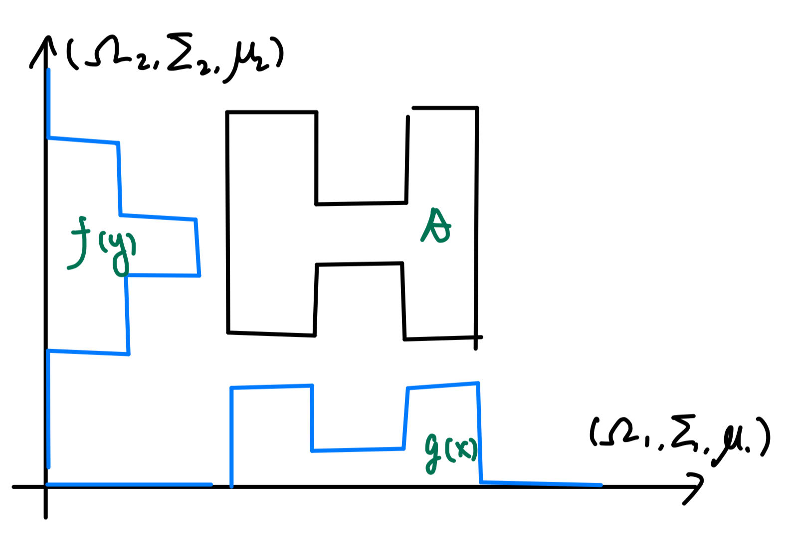

# Iterated integrals {#iteratedIntegrals}

In this section, we consider 

- Two $\sigma$-finite measure spaces $(\Omega_1, \Sigma_1, \mu_1)$ 
    and $(\Omega_2, \Sigma_2, \mu_2)$.
- $\Omega = \Omega_1\times \Omega_2, \Sigma=\Sigma_1\times \Sigma_2$ 
    in the $\sigma$-algebra product \@ref(def:productSigmaAlg). 

Key takeaways: 

1. The product $\sigma$-algebra is characterized by the 
    section property (proposition \@ref(prp:productSection)). 
2. $\sigma$-finiteness is extremely important. 

## Product measure {-}

Recall that, given $A\in \Sigma$, we defined the functions 
\[ 
    A_1(y) = \{x\in \Omega_1: (x, y)\in A\}, \quad 
    A_2(x) = \{y\in \Omega_2: (x, y)\in A\}
\] 

:::{.theorem #productMeasure name="characterization of product measure"}
Fixing $A\in \Sigma$, define 
$f: \Omega_2\to \R$ and $g: \Omega_1\to \R$ by 
$g = \mu_1 \circ A_1, m_2 = \mu_2 \circ A_2$, then 
\[ 
    (\mu_1\times \mu_2)(A) 
    = \int_{\Omega_2} f(y)\, d\mu_2 
    = \int_{\Omega_1} g(x)\, d\mu_1 
\] 
```{r echo=FALSE, fig.align='center', out.width='80%', fig.cap="demonstration of product measure."}
   
```
:::

Proof outline: 

1. $f, g$ are measurable (by monotone class theorem). 
2. 

Consider the set $\mca M\subset \Sigma$ of all 
sets for which $f, g$ defined as above are measurable. 

## Fubini's theorem {-}