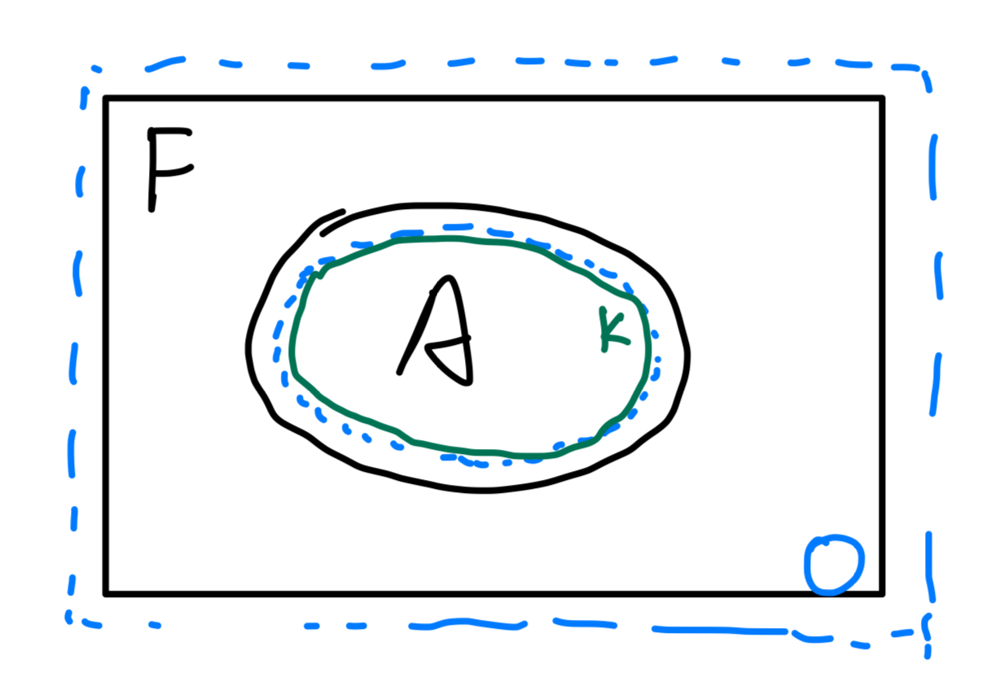
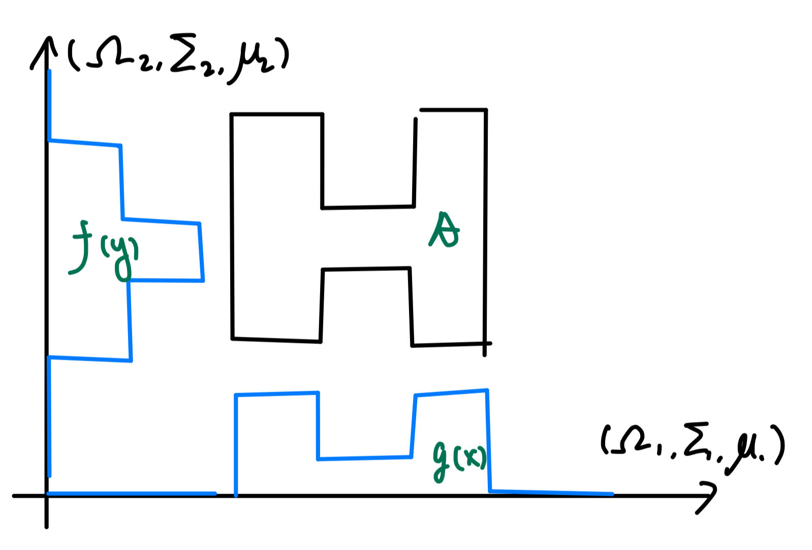

\usepackage{cancel}
\usepackage{amsmath}
\usepackage{bm}
\newcommand{\pd}[1]{\partial_{#1}}

\newcommand{\mbb}{\mathbb}
\newcommand{\mbf}{\mathbf}
\newcommand{\mb}{\boldsymbol}
\newcommand{\mrm}{\mathrm}
\newcommand{\mca}{\mathcal}
\newcommand{\mfk}{\mathfrak}
\newcommand{\tr}{\mrm{tr}} 
\newcommand{\df}{\dfrac}
\newcommand{\la}{\langle}
\newcommand{\ra}{\rangle}
\newcommand{\dag}{\dagger}

\newcommand{\Cl}{\mca C}
\newcommand{\Gr}{\mca G}
\newcommand{\Pf}{\mrm{Pf}}
\newcommand{\Pa}{\mca P}
\newcommand{\R}{\mbb R}
\newcommand{\supp}{\mrm{supp}}

\newcommand{\poly}{\mrm{poly}}


# Preface {-}
These notes accompany the Fall 2024 iteration of Math 114, a second-semester 
undergraduate course on real analysis and measure theory. The notes 
deviate quite a bit from lecture materials, in particular: 

1. I prefer a more principled construction of the Lebesgue measure as the restriction of 
    the exterior measure using the Carathéodory theorem.
    - Sets declared measurable by the Carathéodory criteria are automatically 
    closed under $\sigma$-algebra operations, so 
    one only needs to show the measurability of rectangles 
    to establish the measurability of the Borel sets.
2. Materials are heavily supplemented by Sheldon Axler's 
    _Measure, Integration and Real Analysis_. 

These notes are organized as follows:

1. Abstract machinery of [measures and $\sigma$-algebra](#abstractMachinery). 
    - Lieb and Loss, _Analysis_ (2nd ed), chapter 1. 
2. The [exterior measure and Lebesgue measure](#realMeasures) on $\R^n$. 
    - John K. Hunter, [_Measure theory_](https://www.math.ucdavis.edu/~hunter/measure_theory/measure_notes_ch2.pdf)
        chapter 2. 
3. [Measurable functions, Lebesgue's theory of integration, and Fubini](#integration). 
    - Rudin, _Principles of Real Analysis_, chapter 11; 
    Axler, chapter 2; Lieb and Loss, chapter 1. 
4. $L^p$ spaces. 
    - Lieb and Loss, chapter 2; Axler, chapter 7. 


Course agenda: 

1. Basic elements of measure theory: Lebesgue integration. 
2. $L^p$-spaces, which are constructions which internalize Lebesgue integration. 
3. Fourier analysis, Hilbert spaces. 
4. Radon-Nikadym theorem and Hölder spaces, which are constructions 
    internalizing the RN-theorem and differentiation. 

Nontrivial results: 

1. Monotone class theorem \@ref(thm:monotoneClassTheorem): 
    freely-generated monotone class equals freely-generated $\sigma$-algebra 
    for algebra of sets containing $\Omega$. 
    - Techniques for use (example theorem \@ref(thm:uniqueMeasure)): 
    rewrite nested chain as disjoint union, then pass through the limit 
    using the countable additivity of measures. 
    Next apply the reduction from finite to $\sigma$-finite measures. 
2. Carathéodory measurability theorem \@ref(thm:measureConstruction): 
    given an outer measure $\mu$, the measurable sets $B\subset \Omega$ satisfying 
    $\mu(\forall E) = \mu(E\cap B) + \mu(E\cap B^c)$ form a $\sigma$-algebra 
    and obey countable additivity. 

<!--chapter:end:index.Rmd-->

# Prelimaries 

This section is a dump of various preliminary results for reference. 
Please see the next section for the main content of the course. 

## Topology {-}

First recall some topological definitions:

2. The **norm** $|x|$ of $x$ equals $(\sum x_j^2)^{1/2}$.
3. The **distance** between two points is is $|x-y|$. 
4. The **distance** between two sets is $d(E, F)=\inf_{x\in E, y\in F}|x-y|$. 
5. A set $E$ is **bounded** if it is contained in some ball of finite radius. 
6. A bounded set is **compact** if it is also closed. 
7. A point $x$ is a **limit point** of the set 
    $E$ if $\forall r>0, B_r(x)\cap E\neq \emptyset$. 
8. $x\in E$ is **isolated** if $\exists r>0: B_r(x)\cap E=\{x\}$. 
9. $x\in E$ is an **interior** point if $\exists r>0: B_r(x)\subset E$; the 
    interior points of $E$ is denoted $\mrm{Int}(E)$. 
10. The **boundary** $\partial E = \bar E - \mrm{Int}(E)$. 
11. A closed set $E$ is **perfect** if it does not have any isolated points. 

:::{.proposition #closedSubsetCompact}
A closed subset $A\subset K$ where $K$ is compact, is compact. 
:::
_Proof:_ $V=K-A$ is open 
(if $K$ is a subset, then in the subsace topology), then 
for any $\{U_j\}$ covering $A$, $\{U_j\}\cup \{V\}$ will 
cover $K$. Choose a finite subcover and remove $V$ to obtain 
a finite subcover for $A$. 

:::{.proposition #compactHausdorffClosed}
A compact subset $K$ of a Hausdorff space $\Omega$ is closed. 
:::
<details>
<summary>Proof</summary>
We show that $\Omega-K$ is open: for each $y\in \Omega-K$, 
use Hausdorff to construct a open covering $\{(U_x, V_x)\}_{x\in K}$ 
separating $x, y$ such that $x\in U_x, y\in V_y$. 
Choose a finite subset of $(U_x)_{x\in J\subsetneq K}$ covering $K$, 
then $y\in \bigcap_{x\in J} V_x \subset \Omega-K$, so $\Omega-K$ is open. 
</details>

:::{.proposition #closedBoundedCompact name="closed+bounded=compact"}
For $\R^d$, a set $A$ is compact if and only if it is 
closed and bounded. 
:::
<details>
<summary>Proof</summary>
Given compactness, choose a cover by unit-cube coverings, 
then $A\subset [-R, R]^n$, which is bounded. Closure follows 
from proposition \@ref(prp:compactHausdorffClosed). 
Conversely, given $A\subset [-R, R]^n$ and closed, it is 
a closed subset of a compact set, so it is compact by proposition 
\@ref(prp:closedSubsetCompact)
</details>

:::{.lemma #compactClosedDistance name="finite distance between compact and closed sets"}
If $F$ is closed and $K$ compact, and $F\cap K = \emptyset$, then 
$d(F, K)>0$. 
:::
<details>
<summary>Proof</summary>
By $F^c$ open for each $x\in K$ choose $B(2\delta_x, x)\subset F^c$. 
Choose an finite open subcover $\{B_{\delta_x, x}\}_{x\in [n]}$ of $K$, then 
$d(F, K) > \min_{x\in [n]} \delta_x$. 
</details>

:::{.proposition name="compactness and product"}
$\Omega, Y$ compact implies $\Omega\times Y$ compact. 
:::

:::{.lemma #distanceContinuity name="continuity of distance"}
Given a metric space $(\Omega, d)$ and a subset $Y\subset \Omega$, 
the function $\varphi:\Omega\to \R$ defined below is continuous: 
\[ 
    \varphi(x) = \inf_{y\in Y} d(x, y) 
\] 
:::
<details>
<summary>Proof</summary>
The preimage operation commutes with arbitrary 
union and intersections, so it suffices to demonstrate this 
for open intervals $\{(0, a)\}\cup \{(b, \infty)\}$, to show that 
\[ 
    \varphi^{-1}((0, a)) = \{
        x\in \Omega: \forall \epsilon>0, 
        \exists y\in Y: d(x, y) < a+\epsilon
    \}
\] 
is open, similarly for the other subbasis component. Standard 
argument is omitted. 
</details>

:::{.lemma name="Lebesgue number lemma"}
Given a compact metric space $(\Omega, d)$ and an open cover $(U_j)$ 
of $\Omega$, there $\exists\delta>0$ such that any subset of diameter $<\delta$ 
is entirely contained in a single open set. 
:::
<details>
<summary>Proof</summary>
Select a finite subcover $U_1\cup \cdots \cup U_n$ of 
$\Omega$. The function 
\[ 
    f(x) = \min_j d(x, \Omega-U_j)
\] 
is continuous on compact interval, thus achieves its min $\delta$. 
</details>

:::{.definition name="connected sets"}
A space $\Omega$ is connected if any of the following equivalent conditions 
are true: 

- Every binary partition $U\sqcup V=\Omega$ of $\Omega$ is trivial: $U$ or $V=\emptyset$ 
    and the other $\Omega$.
- The only subsets which are both open and closed in $\Omega$ is $\emptyset, \Omega$.   
:::


## Real analysis {-}

:::{.definition name="limit inferior"}
Given a countable sequence of reals $(a_j)$, the limit inferior is 
\[ 
    \liminf_{n\to \infty} a_n = \lim_{n\to \infty} g_n, \quad 
    g_n = \inf_{k\geq n} a_k 
\] 
The counterpart $\limsup$ is defined similarly. 
:::

:::{.definition name="Riemann integral"}
Fix $[a, b]$ and a partition $a=x_0\leq \cdots \leq x_n =b$, 
define $\Delta x_j = x_j - x_{j-1}$ and 
\begin{align}
    M_j &= \sup f([x_{j-1} \leq x\leq x_j]), \quad 
    m_j = \inf f([x_{j-1} \leq x\leq x_j]) \\ 
    U(P, f) &= \sum_{j=1}^n M_j \Delta x_j, \quad 
    L(P, f) = \sum_{j=1}^n m_j \Delta x_j 
\end{align}
The upper and lower integrals are defined as 
\begin{align}
    \bar{\int}^b_a f\, d\alpha = \inf U(P, f, \alpha), \quad 
    \underline{\int}^b_a f\, d\alpha = \sup L(P, f, \alpha)
\end{align}
:::

:::{.definition name="semi-continuity"}
A real-valued function $f$ is **lower-semicontinuous** 
if 
\[ 
    f^{-1}((t, \infty)) \text{ is open }\forall t
\] 
It is **upper-semicontinuous** when 
$f^{-1}((-\infty, t))$ is open for all $t$. 
:::

:::{.proposition name="equivalent characterization"}
$f:\Omega\to \R$ is lower semi-continuous 
iff any of the following holds for all $x$: 

1. Sequential characterization: 
    $x_n\to x \implies f(x)\leq \liminf f(x_n)$. 
2. Epsilon-delta characterization: 
$\forall \epsilon>0, \exists \delta>0: 
    f(B_\delta(x))>f(x)-\epsilon$. 

The corresponding characterizations of lower-continuity are: 

1. $x_n\to x \implies f(x)$ 
2. $\forall \epsilon>0, \exists \delta>0: 
    f(B_\delta(x)) < f(x)+\epsilon$. 
:::

<!--chapter:end:01-Preliminaries.Rmd-->

# Measures and σ-algebra {#abstractMachinery}

This section develops the abstract machinery of measures and $\sigma$-algebras: 

1. [Definitions](#sigmaDefinition) of $\sigma$-algebra and monotone class theorem. 
2. [Measure spaces and measurable functions](#measurableSpaceFunctions): 
    $\sigma$-finite measures, measures of nested intersections or unions; 
    sufficient conditions for measurable functions; uniqueness of $\sigma$-finite 
    measures (a prime demonstration of the monotone class theorem); 
    product $\sigma$-algebras and measures. 
3. [Carathéodory theorem](#caratheodory): constructing 
    a measure by restricting an outer measure. 

Key takeaways: 

1. A measure space specifies the well-behaved, measurable 
    sets ($\sigma$-algebra), together with a function (called measure) which assigns a measure value 
    to each measurable set. The key desired property of a measure is 
    countable additivity under disjoint unions.
2. The preimage-operation commutes with all closure operations
    of the $\sigma$-algebra. 
3. Monotone class theorem \@ref(thm:monotoneClassTheorem): 
    the monotone class freely generated by an algebra of sets is also its 
    freely-generated $\sigma$-algebra. 
4. The product algebra $\Sigma_1\times \Sigma_2$ is universal and satisfies 
    the section property (proposition \@ref(prp:productSection)). 
5. General method of constructing measures: restricted finite additive measure $\to$ 
    unrestricted countably subadditive (outer) measure $\to$ 
    restricted countably additive measure. 
6. Measurable sets by the Carathéodory criteria 
    (definition \@ref(def:caratheodoryCriteria)) are closed under 
    $\sigma$-algebra operations. 


## σ-algebra {#sigmaDefinition -}

:::{.definition #setAlgebra name="algebra of sets"}
A collection $\mca A$ of sets is an algebra 
of sets if it is closed under finite union and 
differences: 
\[ 
    A, B\in \mca A\implies A\cup B, A-B, B-A\in \mca A 
\] 
:::

:::{.definition name="σ-algebra"}
Given a set $\Omega$, $\Sigma\subset 2^\Omega$ is a $\sigma$-algebra on $\Omega$ if: 

1. $\emptyset\in \Sigma$. 
2. Closure under complement: $E\in \Sigma\implies \Omega-E\in \Sigma$. 
3. Closure under countable union: 
    $\{E_j\}\in \Sigma\implies \bigcup_{k=1}^\infty E_k \in \Sigma$. 
:::

:::{.proposition name="derived properties of σ-algebras"}
Given a $\sigma$-algebra $\Sigma$ on $\Omega$, then 

1. $\Omega\in \Sigma$. 
2. Closure under finite union, intersection, and difference: 
\[ 
    D, E\in \Sigma\implies D\cup E, D\cap E, D-E\in \Sigma 
\] 
3. $E_1, \cdots\in \Sigma\implies \bigcap_{k=1}^\infty E_k \in \Sigma$
:::
_Proof:_ (1) follows from $\Omega=\Omega-\emptyset$. 
(2) follows from $D\cap E = (\Omega-D)\cup (\Omega_E)$ and $D-E=(D\cap E)\cup E$. 
(3) follows from $\bigcap_{k=1}^\infty E_k = \Omega - \bigcup_{k=1}^\infty (\Omega-E_k)$. 

<details>
<summary>Examples and remark</summary>

:::{.example}
Given any set $\Omega$, both $\{\emptyset, \Omega\}$ and $2^\Omega$ are $\sigma$-algebras 
on $\Omega$. The set of all subsets $E$ such that $E$ 
is countable or $\Omega-E$ countable is a $\sigma$-algebra (countable 
union of countable set is countable, else if one element's complement 
is countable, then the union's complement is countable, too). 
:::

:::{.remark}
A $\sigma$-algebra on $\Omega$ is a subset of $2^\Omega$ that contains $\emptyset$ 
and is closed under countable union. Compare to a topology on $\Omega$, which 
is a subset of $2^\Omega$ that contains $\emptyset, \Omega$, and is closed under 
arbitrary unions and finite intersections. 
:::
</details>

:::{.definition name="measurable space, measurable set"}
A measurable space is a pair $(\Omega, \Sigma)$ where $\Sigma$ is a $\sigma$-algebra 
on $\Omega$. 
A subset $S\subset \Omega$ is $\Sigma$-measurable iff $S\in \Sigma$. 
:::

:::{.definition name="freely generated σ-algebra"}
Given a set $\Omega$ and $\mca A\subset 2^\Omega$, the intersection 
of all $\sigma$-algebras $\Sigma$ on $\Omega$ such that 
$\mca A\subset \Sigma$ is a $\sigma$-algebra on $\Omega$. 

In other words, every subset $A\subset 2^\Omega$ freely generates 
a $\sigma$-algebra $\sigma_{\mrm{Alg}}(A)$ on $\Omega$.
:::

:::{.definition name="monotone class"}
A monotone class $\mca M$ is a set of sets with the following 
properties: 
\begin{align}
    A_1, \cdots \in \mca M, \quad A_j\nearrow A &\implies A\in \mca M \\ 
    A_1, \cdots \in \mca M, \quad A_j\searrow A &\implies A\in \mca M
\end{align}
:::

:::{.theorem #monotoneClassTheorem name="monotone class theorem"}
Given a set $\Omega$ and an algebra (definition \@ref(def:setAlgebra)) $\mca A$ 
of subsets of $\Omega$ such that $\Omega, \emptyset\in \mca A$. 
The smallest monotone class $\mca M\supset \mca A$ is $\sigma_{\mrm{Alg}}(\mca A)$. 
:::
<span style="color:green">
Proof idea: every $\sigma$-algebra is trivially a monotone class. 
Monotone class and closure under finite union and complement implies $\sigma$-algebra. 
Show that $\mca M$ is closed under finite union and complements. 
</span>
<details>
<summary>Proof</summary>
If a monotone class $\mca M\supset \mca A$ 
is closed under complement and finite unions, 
then for any $A_1, \cdots\in \mca A$, the sequence of partial unions 
approaches the countable union in limit: 
\[ 
    \left(B_j = \bigcup_{k=1}^j A_j \in \mca M\right) \nearrow
    \bigcup_{j=1}^\infty A_j \in \mca M 
\] 
Together with complements, this shows that that 
$\mca M$ is a $\sigma$-algebra. To show that $\mca M$ 
is indeed closed under complement and finite union, argue for 
every set $A\in \mca M$ that the set $C(A)$ of all sets which 
stay within $\mca M$ under union is a 
monotone class: 
\[ 
    A\cup \bigcup_{j=1}^\infty B_j = \bigcup_{j=1}^\infty A\cup B \in \mca M
\] 
By the algebraic property of $\mca A$ we have 
$\mca A\subset C(A) =\mca M$ (this step requires the minimality of $\mca M$!). 
This shows that $\mca M$ is 
closed under complement and finite union, 
hence is a $\Sigma$-algebra. 
</details>

:::{.corollary} 
Given an algebra of sets, its freely generated monotone class 
(smallest monotone class containing it) is also its freely generated 
$\sigma$-algebra. 
:::

## Measure spaces, measurable functions {#measurableSpaceFunctions -}
:::{.definition name="measure, measure space"}
Given a measurable space $(\Omega, \Sigma)$, a 
measure on $(\Omega, \Sigma)$ is a function 
$\mu:\Sigma\to [0, \infty]$ with 
\[ 
    \mu \left(\bigsqcup_{k=1}^\infty E_k\right) 
    = \sum_{k=1}^\infty \mu(E_k), \quad \mu(\emptyset) = 0 
\] 
for every disjoint sequence $\{E_j\} \in \Sigma$. 
A measure space is an ordered triple $(\Omega, \Sigma, \mu)$. 
:::

:::{.proposition name="elementary properties of measures"}
Given a measure space $(\Omega, \Sigma, \mu)$ and $D\subset E\in \Sigma$: 

1. $\mu(D) \leq \mu(E)$.
2. $\mu(E - D) = \mu(E) - \mu(D)$. 
:::

:::{.proposition name="measure of nested union"}
Under a measure space $(\Omega, \Sigma, \mu)$ with a nested 
chain $E_1\subset E_2\subset \cdots$, we have 
$\mu \bigcup_{j=1}^\infty E_j = \lim_{j\to \infty} \mu(E_j)$.  
:::
<details>
<summary>Proof</summary>
Only consider the case $\mu(E_k) < \infty$ 
and define $E_0=\emptyset$, then 
$\bigcup_{j=1}^\infty E_j = \bigsqcup_{j=1}^\infty E_j - E_{j-1}$. 
Using the disjoint union additivity 
\begin{align}
    \bigcup_{j=1}^\infty E_j 
    &= \sum_{j=1}^\infty \mu(E_j - E_{j-1}) 
    = \lim_{k\to \infty} \sum_{j=1}^k \mu(E_j) - \mu(E_{j-1}) 
    = \lim_{k\to \infty} \mu(E_k)
\end{align}
The dual of the proposition above leads to the following: 
</details>

:::{.corollary name="measure of nested intersection"}
Under a measure space $(\Omega, \Sigma, \mu)$ with a nested 
chain $E_1\supset E_2\supset \cdots$, we have 
$\mu \bigcap_{j=1}^\infty E_j = \lim_{j\to \infty} \mu(E_j)$. 
:::

:::{.definition #finiteMeasure name="finite and σ-finite measures"}
A measure space $(\Omega, \Sigma, \mu)$ is $\sigma$-finite 
if there are countably many sets $A_1, \cdots$ such that 
\[ 
    \mu(A_{\forall j}) < \infty, \quad \Omega = \bigcup_j A_j
\] 
with $\sigma$-finiteness, w.l.o.g. we can prove $A_j$ to be disjoint. 
The measure space is finite if $\mu(\Omega)<\infty$. 
:::


:::{.proposition name="composition preserves measurability"}
Given measurable $f:(\Omega, \Sigma)\to \R^n$ and $g:\R^n\to \R^m$ 
measurable, then $g\circ f$ is $\Sigma$-measurable. 
::: 

We next prove a convenient criteria for proving measurability. 

:::{.proposition name="algebra of function preimages"}
The inverse image operation commutes with elementary algebraic operations: 
given $f:\Omega\to Y$, then 

1. $f^{-1}(Y-A) = \Omega - f^{-1}(A)$. 
2. $f^{-1}(\bigcup_{A\in \mca A} A) = \bigcup_{A\in \mca A} f^{-1}(A)$. 
3. $f^{-1}(\bigcap_{A\in \mca A} A) = \bigcap_{A\in \mca A} f^{-1}(A)$. 
:::

:::{.proposition name="condition for measurable function"}
Given measurable spaces $(\Omega_1, \Sigma_1), (\Omega_2, \Sigma_2)$, 
such that $\Sigma_2 = \sigma_{\mrm{Alg}}(\mca A)$. 
For every function $f:\Omega_1\to \Omega_2$ 
\[ 
    f^{-1}(\forall A\in \mca A) \in \Sigma_1 \implies 
    f \quad \Sigma_1\text{-measurable}. 
\] 
:::
<details>
<summary>Proof</summary>
Consider the subsets 
whose preimage are measurable 
\[  
    \mca T = \{B\in \Sigma_2 | f^{-1}(B)\in \Sigma_1\} \supset \mca A
\] 
It suffices to show that $\Sigma_2 \subset \mca T$. 
To do so, we show that $\mca T$ is a $\sigma$-algebra 
by the well-behavior of set operations under preimage: 

- $\emptyset = f^{-1}(\emptyset) = \emptyset \in \Sigma_1,
    f^{-1}(\Omega_2) = \Omega_1\in \Sigma_1$. 
- For complement: given $B\in \mca T: f^{-1}(\Omega_2-B) = \Omega_1-f^{-1}(B) \in \Sigma_1$. 
- For countable union: 
    $\displaystyle f^{-1}\bigcup B_j = \bigcup f^{-1}B_j \in \Sigma_1$. 

The algebra of preimage commutes with all elementary set operations. 
</details>

:::{.theorem #uniqueMeasure name="uniqueness of measures"}
Given $\Omega$ and $\Sigma = \sigma_{\mrm{Alg}}(\mca A)$, where $\mca A$ 
is a set algebra with $\Omega, \emptyset \in \mca A$. 
If $\mu_1$ is a $\sigma$-finite measure in the stronger sense such that 
\[ 
    \exists \{A_j\in \mca A\}_{i=1}^\infty, \quad \mu_1(A_j)<\infty, \quad 
    \bigcup_{j=1}^\infty A_j=\Omega 
\] 
Then every $\mu_2$ which coincides with $\mu_1$ on $\mca A$ 
satisfies $\mu_1=\mu_2$. 
:::
<details>
<summary>Proof</summary>
First assume that $\mu_1(\Omega)<\infty$. Consider 
\[ 
    \mca M = \{A\in \Sigma: \mu_1(A) = \mu_2(A)\} \supset \mca A
\]  If this is shown to be a monotone class, then $\Sigma\subseteq \mca M$ 
(in fact it's equality by $A\in \Sigma$ condition). Given an 
increasing sequence of sets $A_j\subset \mca M$, construct 
$B_1 = A_1, B_{j>1} = A_j - A_{j-1}$, then 
\[ 
    \mu_1(A_{n\to \infty}) 
    = \mu_1 \bigsqcup_{j=1}^{n\to \infty} B_j 
    = \lim_{n\to \infty} \sum_{j=1}^n \mu_1(B_j) 
    = \lim_{n\to \infty} \mu_1(A_n) = \lim_{n\to \infty} \mu_2(A_n) 
    = \mu_2(A_{n\to \infty}) 
\] 
Additionally, $A\in \mca A\implies A^c\in \mca M$ since $\mu_j(A^c) = \mu_j(\Omega)-\mu_j(A)$
by $\mu_j$ finite, from which $\mca M$ is a monotone class. 
Next, for general $\sigma$-finite measures, $\mu_1(B\cap A_0) = \mu_2(B\cap A_0)$ for every 
$\mu(A_0)<\infty$ and $B\in \Sigma$ since $A_0\cap \Sigma = \sigma_{\mrm{Alg}}(A_0 \cap \mca A)$. 
By $\sigma$-finite assumption choose $\Omega = \bigsqcup A_j$ each with finite measure, then 
\[ 
    \mu_1(B\in \Sigma) = \mu_1 \bigsqcup_{j=1}^\infty A_j\cap B 
    = \sum_{j=1}^\infty \mu_1(A_j\cap B) 
    = \sum_{j=1}^\infty \mu_2(A_j\cap B) = \mu_2(B)
\] 
</details>

:::{.definition #productSigmaAlg name="product σ-algebra"}
The product $\sigma$-algebra is the smallest 
$\sigma$-algebra containing all rectangles. 
\[ 
    \Sigma = \sigma_{\mrm{Alg}}(\Sigma_1\times \Sigma_2) 
    = \sigma_{\mrm{Alg}}\left(\{
        A_1\times A_2 | A_1\in \Sigma_1, A_2\in \Sigma_2
    \}\right)
\] 
where here $\Sigma_1\times \Sigma_2$ denotes the Cartesian 
product of sets. The product measure $\mu = \mu_1\times \mu_2$ is 
:::


:::{.proposition #productSection name="section property of product algebra"}
The product $\sigma$-algebra $\Sigma = \Sigma_1\times \Sigma_2$ 
has the <u>section property</u>: $\forall A\in \Sigma$, define 
\[ 
    A_1(x_2)\in \Omega_1 = \{x_1\in \Omega_1: (x_1, x_2)\in A\}
\] 
then $A_1(x_2)\in \Sigma_1$ for every choice of $x_2$. 
:::
<details>
<summary>Proof</summary>
The set $\Sigma'$ of all subsets of $\Omega_1\times \Omega_2$ 
(regarded as Cartesian product of sets) 
satisfying the section property is a $\sigma$-algebra containing 
$\Sigma_1\times \Sigma_2$; the proof concludes by the universal 
property of $\Sigma_1\times \Sigma_2$. 
</details>


:::{.definition name="product measures"}
The product of two measure spaces is 
\[ 
    (\Omega_1\times \Omega_2, \Sigma_1\times \Sigma_2, \mu_1\times \mu_2) 
    = (\Omega_1, \Sigma_1, \mu_1)\times (\Omega_2, \Sigma_2, \mu_2)
\] 
where $\Omega_1\times \Omega_2$ is the Cartesian product of sets, 
$\Sigma_1\times \Sigma_2$ is the $\sigma$-algebra product 
\@ref(def:productSigmaAlg), 
and $\mu_1\times \mu_2$ is uniquely 
defined by the requirement 
\[ 
    \mu(A_1\times A_2) = \mu_1(A_1) \mu_2(A_2)
\] 
The exact definition and uniqueness of the 
product measure is postponed to 
theorem \@ref(thm:productMeasure). 
:::

## Carathéodory theorem {#caratheodory -}

:::{.definition #defOuterMeasure name="outer measure"}
Given a set $\Omega$, a function $\mu:2^\Omega\to \R_{\geq 0}$ 
is an outer measure if it satisfies: 

1. <u>non-negativity</u>: $\mu(\emptyset) = 0$. 
2. <u>monotonicity</u>: $A\subset B\implies \mu(A) \leq \mu(B)$. 
3. <u>countable sub-additivity</u>: for any countable collection of 
    subsets $A_j\subset \Omega$: 
    \[ 
        \mu \bigcup_{j=1}^\infty A_j \leq \sum_{j=1}^\infty \mu(A_j)
    \] 
:::

:::{.definition #caratheodoryCriteria name="Carathéodory criteria"}
Given an outer measure $\mu:2^\Omega\to \R_{\geq 0}$, 
a set $S\subset \Omega$ satisfies the Carathéodory criteria (for measurability) 
if 
\[ 
    \mu(\forall E) = \mu(E\cap A) + \mu(E\cap A^c) 
\] 
The set $S$ is also said to be measurable (by the Carathéodory criteria). 
:::

:::{.lemma #caratheodorySetAlgebra name="measurable sets form a set-algebra"}
The set $\Sigma\subset 2^\Omega$ of measurable sets is an algebra of sets 
that contains $\emptyset, \Omega$. 
:::
<details>
<summary>Proof</summary>
We have $\emptyset, \Omega \in \Sigma$ 
by definition \@ref(def:caratheodoryCriteria) immediately. 
To show that $\Sigma$ is closed under countable intersection: 
given $A, B\in \Sigma$, applying the given condition on $(E, A), (\cdot, B)$ yields  
\begin{align}
    \mu(E) 
    &= \mu(E\cap A) + \mu(E\cap A^c)  \\ 
    &= \mu(E\cap A\cap B) + \mu(E\cap A\cap B^c) + \mu(E\cap A^c\cap B) 
    + \mu(E\cap A^c \cap B^c)
\end{align}
We wish to show that the RHS equals 
$\mu(E\cap A\cap B) + \mu(E\cap (A\cap B)^c)$. 
To this end, note that (using addition in place of union to reduce clutter): 
\begin{align}
    (A\cap B)^c &= A^c\cap B + A\cap B^c + A^c\cap B^c \\ 
    \mu(E\cap (A\cap B)^c) &= \mu(E\cap (A\cap B)^c\cap A) + 
    \mu(E\cap (A\cap B)^c \cap A^c) \\ 
    &= \mu(E\cap A\cap B^c) + \mu(E\cap A^c\cap B + E\cap A^c\cap B^c) \\ 
    &= \mu(E\cap A\cap B^c) + \mu(E\cap A^c\cap B) + \mu(E\cap A^c\cap B^c) \\ 
\end{align}
</details>

The following lemmas each depend on the previous one and culminates in the 
Carathéodory theorem. 

:::{.lemma name="countable additivity on measurable sets"}
Given disjoint sets $B_1, \cdots \in \Sigma$: 
\[ 
    \mu \left(
        E\cap \bigsqcup_{j=1}^\infty B_j 
    \right) = \sum_{j=1}^\infty \mu(E\cap B_j)
\] 
In particular, $\mu$ is countable additive on $\Sigma$ by setting $E=\Omega$: 
\[ 
    \mu \bigsqcup_{j=1}^\infty (B_j\in \Sigma) = \sum_{j=1}^\infty \mu(B_j) 
\] 
:::
<details>
<summary>Proof</summary>
For disjoint $B_1, B_2\in \Sigma$, applying 
definition \@ref(def:caratheodoryCriteria) yields 
$\mu(B_1\sqcup B_2) = \mu(B_1) + \mu(B_2)$; finite additivity follows by induction. 
In particular, this implies the following limit 
since it holds for each $m$ 
\[ 
    \lim_{m\to \infty} \mu\left(
        E\cap \bigsqcup_{j=1}^m B_j 
    \right)
    = \sum_{j=1}^\infty \mu(E\cap B_j)
    (\#eq:caratheodoryLimit)
\] 
We next show countable additivity: given disjoint $B_1, \cdots$ 
\[ 
    \lim_{m\to \infty} \mu\left(
        E\cap \bigsqcup_{j=1}^m B_j 
    \right) \leq \mu \left(
        E\cap \bigsqcup_{j=1}^\infty B_j 
    \right) = \mu \left(\bigsqcup_{j=1}^\infty E\cap B_j\right) 
    \leq \sum_{j=1}^\infty \mu(E\cap B_j)
\] 
But the LHS and RHS are exactly those of equation \@ref(eq:caratheodoryLimit), so 
we obtain the equality by sandwich-ing 
\[ 
    \mu \left(
        E\cap \bigsqcup_{j=1}^\infty B_j 
    \right) = \sum_{j=1}^\infty \mu(E\cap B_j)
\] 
</details>

:::{.lemma name="Carathéodory-measurable sets form a sigma-algebra"}
$\Sigma$ is a $\sigma$-algebra; equivalently 
in light of lemma \@ref(lem:caratheodorySetAlgebra), 
\[ 
    B_{\forall j}\in \Sigma\implies \bigcup_{j=1}^\infty B_j \in \Sigma 
\] 
:::
<details>
<summary>Proof</summary>
Without loss of generality assume $B_j$ distinct. 
One direction follows from countable subadditivity: 
\[ 
    \mu(E) = \mu((E\cap B)\cup (E\cap B^c)) \leq \mu(E\cap B) + \mu(E\cap B^c)
\] 
For the other direction, the following equation holds for each $m$ thus in limit 
\[ 
    \mu_E = \lim_{m\to \infty} \mu\left(E\cap \bigcup_{j=1}^m B_j \right) + \mu \left[
        E\cap \left(\bigcup_{j=1}^m B_j\right)^c
    \right]
    (\#eq:caratheodoryuni) 
\] 
The limit of the first term is known to be $\mu(E\cap B)$, the second term 
\[ 
    \mu \left[
        E\cap \left(\bigcup_{j=1}^m B_j\right)^c
    \right] \geq \mu(E\cap B^c) 
\] 
by subadditivity; substituting into equation \@ref(eq:caratheodoryuni)
completes the proof. 
\[ 
    \mu_E \geq \mu\left(E\cap \bigcup_{j=1}^\infty B_j \right) + \mu \left[
        E\cap \left(\bigcup_{j=1}^\infty B_j\right)^c
    \right]
\] 
</details>

:::{.theorem #measureConstruction name="Carathéodory theorem"}
Given an outer measure $\mu:2^\Omega\to \R_{\geq 0}$: 

1. The collection $\Sigma\subset 2^\Omega$ of subsets 
    satisfying Carathéodory's criterion is a $\sigma$-algebra, 
2. $\mu:\Sigma\to \R_{\geq 0}$ is a countably additive measure on $\Sigma$. 
:::

<!--chapter:end:02-Measure.Rmd-->

# Measure on $\R^n$ {#realMeasures}

This section establishes the base case of the Lebesgue 
measure on $\R^n$: 

1. [Exterior measure](#extMeasure): foundational properties of the exterior 
    measure and interaction with rectangles. 
2. [Lebesgue measure and Borel regularity](#lebMeasure): 
    definition and relation with Borel sets, 
    characterization of measurable sets, example of a non-measurable set. 
3. [Measurable functions](#realMeasurableFunctions): .

Key takeaways: 

1. The exterior measure is the natural outer-measure extension of rectangle volume that 
    satisfies _monotonicity_, _countable subadditivity_, 
    and agrees with our initial definition. 
2. The Lebesgue measure is the Carathéodory restriction of the exterior measure. 
3. Rectangles are measurable (proposition \@ref(prp:rectangleMeasurable)), 
        so Borel sets are measurable since they 
        are freely-generated by rectangles. 
4. The exterior measure (rectangle cover infimum) 
    is equivalent to open cover infimum, and on measurable sets equivalent 
    to compact subset supremum. 
5. A set is measurable iff 
    - it can be upper-approximated by an open cover 
    or lower-approximated by a closed subset up to arbitrarily small but 
    finite measure \@ref(thm:squeezeMeasurable). 
    - it can be approximated by a Borel set up 
    to zero measure \@ref(thm:borelApprox). 

## Rectangles, exterior measure {#extMeasure -}

:::{.definition name="exterior measure"}
The exterior measure $\mu_*(E)$ of any subset $E\subset \R^n$ is 
\[ 
    \mu_*(E) = \inf \sum_{j=1}^\infty |R_j|
\] 
where the $\inf$ is over all countable coverings of $E$ by 
closed rectangles, the measure of a closed rectangle 
$R_j = \prod_{j=1}^n [a_j, b_j]$ is $|Q_j| = \prod_{j=1}^n (b_j - a_j)$. 
:::

:::{.proposition}
The exterior is an outer measure per definition \@ref(def:defOuterMeasure). 

- $E_1\subset E_2\implies \mu_*(E_1)\leq \mu_*(E_2)$. 
- $E=\bigcup_{j=1}^\infty E_j\implies \mu_*(E)\leq \sum_{j=1}^\infty \mu_*(E_j)$. 
:::
<details>
<summary>Proof</summary>
To prove monotonicity, every covering of $E_2$ by a countable set of cubes 
is also a covering of $E_1$. 
For countable subadditivity, the main idea is to construct increasingly 
tight covers such that the countable union of 
these covers is still finitely tight. 
Assume the nontrivial case $\mu_*(E_j)<\infty$. 
For every $\epsilon>0$, we can construct for each $j$ a covering 
\[ 
    E_j\subset \bigcup_{k=1}^\infty R_{k, j}, \quad 
    \sum_{k=1}^\infty |R_{k, j}| \leq \mu_*(E_j) + \df{\epsilon}{2^j}
\] 
The increasingly tight bound ensures that 
\begin{align}
    \mu_*(E) 
    &\leq \sum_{j, k}|R_{k, j}| \leq \sum_{j=1}^\infty \mu_*(E_j) + \df \epsilon {2^j} 
    = \sum_{j=1}^\infty \mu_*(E_j)+\epsilon
\end{align}
</details>

:::{.proposition #openCoverInfimum name="equivalence with open cover infimum"}
Given $E\subset \R^n$, $\mu_*(E)=\inf \mu_*(\mca O)$, where $\inf$ is 
over all open sets $\mca O$ covering $E$. 
:::
<details>
<summary>Proof</summary>
$\mu_*(E)\leq \inf \mu_*(\mca O)$ holds by monotonicity. 
For the other direction, choose cubes $R_j$ covering $E$ 
with margin $\epsilon/2$, and for each cube choose open cube 
$O_j$ covering $R_j$ with margin $\epsilon/2^{j+1}$, then $(O_j)$ 
cover $E$ with margin $\epsilon$. 
</details>

Given a countable set $R_j$ of disjoint rectangles, it is 
intuitive (and easy to show that) 
\[ 
    \mu_*\bigsqcup_{j=1}^\infty R_j = \sum_{j=1}^\infty \mu_*(R_j)
\] 
This is our base case for establishing measurability later on. 

The following proposition is the main reason why we chose closed 
rectangles (instead of open, though they are effectively the same) 
as the basic measurable sets. 

:::{.proposition #finiteDistanceAdditivity name="additivity with finite distance"}
If $E=E_1\cup E_2$ and $d(E_1, E_2)>0$, then 
\[ 
    \mu_*(E) = \mu_*(E_1)+\mu_*(E_2) 
\] 
:::
<details>
<summary>Proof</summary>
By subadditivity, $\mu_*(E)\leq \mu_*(E_1)+\mu_*(E_2)$. 
To show the converse, select $0<\delta < d(E_1, E_2)$ and 
choose a cover $(Q_j)$ of $E$ by closed cubes with margin $\epsilon$. 
Subdivide $(Q_j)$ so that each has size less than $\delta$, so 
that each cube intersects at most one of $E_1, E_2$. Denote by 
$J_1, J_2$ the indices for which $Q_j$ intersects $E_1, E_2$, then 
$E_1, E_2$ are covered by $Q_{J_1}, Q_{J_2}$ respectively. 
</details>

:::{.corollary #almostDisjointAdditivity name="additivity of almost-disjoint rectangles"}
The exterior measure is additive on 
countable collections of almost-disjoint rectangles $R_j\in \mbb R^d$. 
:::
<details>
<summary>Proof</summary>
Give $\epsilon>0$, shrink rectangle $j$ by $\epsilon/2^j$ so they 
are closed sets with finite distance, then invoke additivity through 
proposition \@ref(prp:finiteDistanceAdditivity). 
</details>


:::{.proposition #rectangleMeasurable name="Carathéodory criteria for rectangles"}
Given a rectangle $\subset \R^n$, 
\[ 
    \mu_*(\forall E\subset \R^n) = \mu_*(E\cap R)+ \mu_*(E\cap R^c)
\] 
:::
<details>
<summary>Proof</summary>
To prove the nontrivial direction 
$\mu_*(E\cap R)+ \mu_*(E\cap R^c)\leq \mu_*(\forall E\subset \R^n)$, 
choose an $\epsilon$-cover $R_j$ of $E$, then 
rectang-ify $R_j$ into $R^1_j, R^2_j$ covering 
$E\cap R, E\cap R^c$ respectively and invoke corollary 
\@ref(cor:almostDisjointAdditivity). This shows that 
\[ 
    \mu_*(E\cap R)+ \mu_*(E\cap R^c)
    \leq \mu_*(\forall E\subset \R^n) + \epsilon, \quad \forall \epsilon>0 
\] 
</details>

<span style="color:green">
Boundaries to not always have nontrivial measures
(e.g. $\mbb Q\cap [0, 1]$). There are even 
boundaries of closed sets which have nontrivial measure 
(e.g. fat Cantor set). 
</span>


## Lebesgue measure, Borel regularity {#lebMeasure -}

:::{.definition name="Lebesgue measure"}
The set $\mca L\subset \R^n$ of Lebesgue measurable sets 
are the Carathéodory-measurable sets of the exterior measure: 
\[ 
    S\in \mca L \iff \mu(\forall E\subset \R^n) = \mu(E\cap S)+\mu(E\cap S^c)
\] 
:::

Note that one direction in the Carathéodory criterion always holds: 
\[ 
    \mu(E) \leq \mu(E\cap B) + \mu(E\cap B^c)
\] 

:::{.proposition name="null sets are measurable"}
$\mu(E\subset \R^n)=0\implies E\in \mca L$. 
:::
<details>
<summary>Proof</summary>
To show the nontrivial direction, $\mu(E\cap B)\leq \mu(E)=0$, then 
$\mu(E\cap B^c) \leq \mu(E)$ by subadditivity. 
</details>

:::{.definition name="Borel sets"}
The Borel set $\mca B\subset 2^{R^n}$ is the $\sigma$-algebra 
freely generated by rectangles. 
:::

:::{.theorem name="Borel sets are Lebesgue measurable"}
$\mca B\subset \mca L$. 
:::
_Proof:_ Proposition \@ref(prp:rectangleMeasurable) states that rectangles 
are measurable; invoking the machinery we built in the section 
on the [Carathéodory theorem](#caratheodory) we obtain that 
the elements of the $\sigma$-algebra freely generated by rectangles (Borel subsets) 
are measurable. 

### A non-measurable set {-}

Write $x\sim y$ if $x-y$ is rational and let $\mca E_\alpha$ 
be the equivalence class of $\alpha$. Then 
$[0, 1]=\bigcup \mca E_\alpha$ and construct 
$\mca N$ by choosing one element $x_\alpha$ from 
each $\mca E_\alpha$. 

:::{.proposition} 
$\mca N$ is not measurable.
:::
_Proof:_ Assume $\mca N$ measurable and let 
$\{r_k\}_{k=1}^\infty$ be an enumeration of all rationals 
in $[-1, 1]$ and consider $\mca N_k = \mca N + r_k$. Then 
all $\{\mca N_k\}$ are disjoint. Note that 
\[ 
    [0, 1] \subset \bigsqcup_{k=1}^\infty \mca N_k \subset [-1, 2]
\] 
Assuming measurability (contradiction!), we have 
\[ 
    1\leq \sum_{k=1}^\infty \mu(\mca N_k) \leq 3 
\] 
Every term in the sum is equal, but there is no real number 
which satisfies the construction above; contradiction: 
there cannot be a disjoint-additive function on the disjoint 
countable collection $\{\mca N_k\}$. 

### Approximation of measurable sets {-}

We have seen that the exterior measure is equivalent to open cover infinum 
\@ref(prp:openCoverInfimum). We also have 

:::{.proposition #measurableCompactSupremum name="compact subset supremum"}
If $A$ is Lebesgue measurable, then 
\[ 
    \mu(A) = \sup_{K\subset A\text{ compact}} \mu(K)
\] 
:::
<details>
<summary>Proof</summary>
The trivial direction is $\sup_{K\subset A\text{ compact}} \mu(K) \leq \mu(A)$. 
We wish to show, $\forall \epsilon>0$, that 
\[ 
    \exists K\subset A\text{ compact}: \mu(K) + \epsilon \geq \mu(A)
\] 

```{r echo=FALSE, fig.align='center', out.width='80%', fig.cap="$A$ bounded"}
   
```

1. First suppose $A$ bounded; consider compact $F\supset A$, 
    then there is an open set $G\supset F-A$ which $\epsilon$-approximates
    $F-A$, then $K=A\cap O^c$ is a compact sub-$\epsilon$ subset approximation 
    of $A$. 
    - $K$ must be compact, else $F\subset K\cup O$ will not be compact. 
2. $A$ unbounded: we can construct for each $j\in \mbb N$ 
    an $\epsilon$-approximation of $A_j = A\cap \overline{B_j(0)}$ 
    with $A_j\to A\implies \mu(A_j)\to \mu(A)$. 
</details>

:::{.theorem #openCoverMeasureApprox name="measurability by open cover approximation"}
$A\subset \R^n$ is Lebesgue measurable iff $\forall \epsilon>0$, 
there exists $G\supset A$ such that 
\[ 
    \mu_*(G - A) < \epsilon 
\] 
:::
<details>
<summary>Proof</summary>
Given $A$ measurable, the result follows from open cover 
infimum proposition \@ref(prp:openCoverInfimum). 
Conversely, suppose $A\subset \R^n$ satisfies the conditions 
in the theorem, then choose an $\epsilon$-cover $G\supset A$. 
Note that 
\[ 
    E\cap A^c = E\cap G^c + E\cap (G-A)
\] 
Directly verify the Carathéodory criterion: we use the 
measurability of $G$ and subadditivity 
\begin{align}
    \mu_*(E\cap A) + \mu_*(E\cap A^c) 
    &= \mu_*(E\cap A) + \mu_*(E\cap A^c)  \\ 
    &\leq \mu_*(E\cap G) + \mu_*(E\cap G^c) + \mu_*(E\cap (G-A)) \\ 
    &\leq \mu_*(E\cap G) + \mu_*(E\cap G^c) + \mu_*(G-A)_{< \epsilon} \\ 
    &< \mu_*(E\cap G) + \mu_*(E\cap G^c) + \epsilon 
    = \mu_*(E\cap G) + \epsilon
\end{align}
</details>

:::{.theorem #squeezeMeasurable name="measurability by squeezing"}
$A\subset \R^n$ is Lebesgue measurable iff $\forall \epsilon>0$, 
there exists open $G$, closed $F$, with $F\subset A\subset G$ such that 
$\mu_*(G - F) < \epsilon$. 
:::
_Proof:_ If $A$ satisfies the theorem conditions, then 
$\mu_*(G - A) \leq \mu_*(G - F)<\epsilon$ so $A$ is measurable 
by theorem \@ref(thm:openCoverMeasureApprox). 
Conversely, given $A$ measurable, by theorem \@ref(thm:openCoverMeasureApprox) 
choose $\epsilon/2$-covers of both $A$ and $A^c$. 

:::{.theorem #borelApprox name="measurability by Borel approximation"}
$A\subset \R^n$ is Lebesgue measurable iff there 
exists Borel sets $G, F$ with $F\subset A\subset G$ such that 
\[ 
    \mu(G - A) = \mu(A - F) = 0
\] 
:::
_Proof:_ By theorem \@ref(thm:squeezeMeasurable), construct for each 
$k\in \mbb N$ sets $G_k, F_k$ which $1/k$-squeeze $G$, then 
$G=\bigcap G_k, F=\bigcup F_k$ proves the theorem. 


## Measurable functions on $\R^n$ {#realMeasurableFunctions -}
:::{.proposition name="measurable function"}
Given a measurable space $(\Omega, \Sigma)$. A function 
$\Omega\to \R^n$ is $\Sigma$-measurable if 
$f^{-1}(B) \in \Sigma$ 
for every Borel set $B\subset \R^n$. 
:::

:::{.example}
If $\Sigma=\{\emptyset, \Omega\}$, then the only $\Sigma$-measurable 
functions from $\Omega\to \R^n$ are constant functions. On the 
other extreme, if $\Sigma=2^\Omega$, then every function is measurable. 
For a nontrivial example, if $\Sigma=\{\emptyset, (-\infty, 0), [0, \infty), \R\}$ 
then $f:\R\to \R$ is measurable iff it is 
constant on $(-\infty, 0), [0, \infty)$. 
:::

:::{.definition name="characteristic function"}
Given $E\subset \Omega$, the characteristic function $\chi_E:\Omega\to \R$ is 
\[ 
    \chi_E(x) = \begin{cases}
        1 & x\in E \\ 
        0 & x\notin E
    \end{cases}
\] 
:::

:::{.proposition name="property of characteristic function"}
Given $(\Omega, \Sigma), E\subset \Omega$, then $\chi_E$ is $\Sigma$-measurable 
iff $E\in \Sigma$. 
:::
_Proof:_ 
$\chi_E^{-1}(B) = \{E, \Omega-E, \Omega, \emptyset\}$ 
depending on how $B\subset \R$ intersects with $\{0, 1\}$. 

:::{.proposition name="continuity implies Borel measurability"}
Every continuous function $f:\Omega\to \R^n$ defined on 
a Borel subset $\Omega\subset \R^m$ is a Borel-measurable function. 
:::
_Proof:_ Consider the preimage of $x>a$ ($x, a\in \R^n$ and inequality 
holds elementwise). For any such $a$, consider 
\[ 
    f^{-1}(x>a) 
    = \left[\bigcup_{x\in f^{-1}(x>a)} (x-\delta_x, x+\delta_x) \right]\cap \Omega
\] 
Given every $x\in \R^m: f(x)>a$, by continuity $\exists \delta_x\in \R$ 
such that $f((x-\delta_x, x+\delta_x))>a$. The term in the paranthesis 
is an open set, hence its intersection with the Borel set $\Omega$ is Borel. 

$f:(\Omega\subset \R)\to \R$ is increasing if $x < y\implies f(x)\leq f(y)$; 
it is monotonic if $f$ or $-f$ is increasing. 

:::{.proposition}
if $f:\Omega\to \R$ is monotonic and $\Omega$ is Borel, then $f$ is measurable. 
:::
_Proof:_ Fix $a\in \R$, then for $b=\inf f^{-1}((a, \infty))$, 
monotonicity implies 
\[ 
    f^{-1}((a, \infty)) = (b, \infty)\cap \Omega 
    \text{ or }
    [b, \infty)\cap \Omega
\] 

:::{.proposition name="preservation of measurability under limits"}
Suppose $\{f_j\}\to f:(\Omega, \Sigma)\to \R^n$ point-wise each $f_j$ 
is $\Sigma$-measurable, then $f$ is $\Sigma$-measurable. 
:::
_Proof:_ Unrolling the definition of the limit: for any 
$x\in \Omega, a\in \R^n$, $f(x)>a$ iff 
\begin{align}
    & \lim_{k\to \infty} f_k(x) > a \\ 
    \iff & \exists j>0, \exists N: f_{\forall k>N}(x)>a+1/j \\ 
    \iff & x\in \bigcup_{j=1}^\infty 
        \bigcup_{N=1}^\infty 
        \bigcap_{k=1}^\infty f_k^{-1}(y>a+1/j)
\end{align}
Note that we only need some $j$ to exist. Each $\exists$ translates 
to $\bigcup$, and each $\forall$ translates to $\bigcap$. Then 
the preimage of $y>a$ the measurable set above. 

:::{.definition name="extended Borel"}
$A\subset [-\infty \infty]$ is a Borel set if $A\cap \R$ is Borel. 
Extended measurability is defined similarly. 
:::

:::{.theorem name="variational limits are measurable"}
Given measurable $\{f_k: (\Omega, \Sigma)\to \R\}$, the following functions 
are also measurable: 
\[ 
    g(x) = \inf_k f_k(x), \quad h(x) = \sup_k f_k(x)
\] 
:::
_Proof:_ It suffices to verify for the $\sup$ case that 
\begin{align}
    h(x) > a &\implies \exists k: f_k(x) > a \\ 
    h^{-1}((a, \infty]) &= \bigcup_{k=1}^\infty f_k^{-1}((a, \infty])
\end{align} 

:::{.proposition name="a.e. measurability"}
Given $f$ measurable and $f=g$ a.e. (they differ on a set of 
measure $0$ on the domain), then $g$ is measurable. 
:::
_Proof:_ Let $\{\mca A\}$ be a subbasis generating the measurable  
sets, then $\forall A\in \mca A$, the symmetric difference of 
pre-images $f^{-1}(A), g^{-1}(A)$ is dominated by a set of 
measure $0$; by measurability $g^{-1}(A)$ is measurable, 
so $f^{-1}(S)$ is also measurable. 

Some notations are convenient: 

:::{.definition #setSequenceNotation name="sequence of sets"}
An increasing sequence of sets $\{A_n\}$ is a sequence 
\[ 
    A_1\subset A_2\subset \cdots \to A = \bigcup_{n=1}^\infty A_n
\] 
also written $A_j\nearrow A$. Similarly, a decreasing 
sequence of sets is written $A_j\searrow A$. 
\[ 
    A_1\supset A_2\supset \cdots \to A = \bigcap_{n=1}^\infty A_n 
\] 
:::

## Simple functions {-}

:::{.definition name="simple function"}
A simple function is a finite sum 
\[ 
    f = \sum_{k=1}^N a_k \chi_{E_k} 
\] 
where each $E_k$ is a finite-measurable set. 
:::

The following proof is from Ch. 11 of [@rudin1964principles]. 

:::{.theorem #simpleFunctionApproximation name="simple-function approximation"}
Given a real function $f:\Omega\to \R$, there exists a sequence 
$\{s_n\}$ of simple functions such that $s_n(x)\to f(x)$ 
point-wise. If $f$ is measurable, then $\{s_n\}$ 
may be chosen to be a sequence of measurable functions. 
If $f\geq 0$, then $\{s_n\}$ may be chosen to be a monotonically 
increasing sequence. 
:::
_Proof:_ Given $f\geq 0$, define $F_n = f^{-1}([n, \infty))$ and 
\[ 
    E_{n, i} = f^{-1} \left(\left[2^{-n}(i-1), 2^{-n}i \right]\right)
\] 
For $n=1, 2, \cdots$ and $i=1, 2, \cdots, n2^n$, choose 
\[ 
    s_n = n\chi_{F_n} + \sum_{i=1}^{n2^n} \df{i-1}{2^n} \chi_{E_{n, i}}
\] 
Note that $E_{n, i}$ is the pre-image of the $i$-th slice of 
nonnegative real blocks of size $2^{-n}$, and the first term assigns 
$\inf f=2^{-n}(i-1)$ on the corresponding intervals. The second 
term just assigns approximates with $n$ all places where $f(x)\geq n$. 
The second term is reserved for cases where $f(x)=\infty$. In short: 

1. In the $n$-th approximation, approximate $f$ up to value $n$. 
2. Divide $f^{-1}([0, n])$ into $2^{-n}$ pieces and assign a dominated 
    simple function. Approximate the rest simply with $n$. 

If $f$ is measurable, the domains of the characteristic decomposition 
are measurable so $s_n$ is measurable. The general case follows by 
$f=f^+-f^-$. 

## Littlewood's three principles {-}

Littlewood's three principles are: 

1. Every finite-measurable set is almost a finite union of intervals. 
2. Every measurable function is almost continuous. 
3. Every pointwise convergent sequence of measurable functions 
    is almost uniformly convergent. 

To be precise, the third principle is formulated as follows: 

:::{.theorem name="Egorov's theorem"}
Given a a measurable sequence $(f_k)$ on a finite-measurable set 
$E$ with $\mu(E)<\infty$ such that $f_k\to f$ a.e. on $E$. 
For every $\epsilon>0$, there exists a closed set $A_\epsilon \subset E$ 
such that $\mu(E-A_\epsilon)<\epsilon$ and $f_k\to f$ uniformly 
on $A_\epsilon$ 
:::
_Proof:_ without loss of generality assume $f_k\to f$ pointwise (not just 
pointwise a.e.) since we only require $\mu(E-A_\epsilon)<\epsilon$; 
for each $n, k$, define 
\[ 
    E_k^n = \{x\in E: |f_{\forall j>k}(x) - f(x)|<1/n\}
\] 
In other words, this is the set on which $f_{j>k}$ is 
$1/n$-close to $f$ on $E$. Fix $n$. Note that 
$E^n_k\nearrow E$ by $f_k\to f$ (recall definition 
\@ref(def:setSequenceNotation)); then there exists $k_n$ 
such that 
\[ 
    \mu(E - E^n_{k_n}) < 2^{-n}, \quad 
    \sup_{x\in E^n_{k_n}} |f_j(x) - f(x)| < 1/n 
\] 
Choose $N$ so that $\sum_{n=N}^\infty 2^{-n}<\epsilon/2$ and let 
\[ 
    \tilde A_\epsilon = \bigcap_{n\geq N} E^n_{k_n}
\] 
This is domain subset on which, for each $n\geq N$, 
$|f_{j\geq k_n}(x) - f(x)| \leq 1/N$; also note that 
\[ 
    \mu(E - \tilde A_\epsilon) \leq \sum_{n=N}^\infty \mu(E - E^n_{k_n}) 
    < \epsilon/2 
\] 
Also note that $\tilde A_\epsilon$ is measurable since it is the 
intersection of $E^n_k$ which are pre-images; then by measurability 
characterization \@ref(thm:measurableCharacterization) there exists a 
closed $\epsilon/4$-coveree $A_\epsilon$ of $\tilde A_\epsilon$. 
Moreover, $f_k\to f$ uniformly on $A_\epsilon$ since for every 
$0<\epsilon'<1/n$, $|f_j(x)-f(x)|<\epsilon'$ when $j>k_n$ and 
$x\in E^n_{k_n} \supset A_\epsilon$. 

Similarly, the precise statement of the second principle is: 

:::{.theorem name="Lusin's theorem"}
Given measurable $f$ finite-valued on $E$ and $\mu(E)<\infty$, then 
for every $\epsilon>0$ there exists a closed $\epsilon$-coveree 
$F_\epsilon \subset E$ with $\mu(E-F_\epsilon)<\epsilon$ such that 
$f_{|F_\epsilon}$ is continuous in the subspace topology. 
:::
_Proof:_ <span style="color:red"> TODO </span>

<span style="color:green">
Lusin's theorem _does not claim_ that $f$ is continuous on $F_\epsilon$, 
only that $f_{|F_\epsilon}$ is continuous in the subspace topology. 
</span>

## Product measures, Fubini {-}

:::{.theorem #productMeasure name="characterization of product measure"}
Given two $\sigma$-finite measure spaces $(\Omega_1, \Sigma_1, \mu_1)$ and 
$(\Omega_2, \Sigma_2, \mu_2)$ define, for every measurable 
$A\in \Sigma_1\times \Sigma_2$: 

1. $f(y) = \mu_1(A_1(y)) = \mu_1(\{x\in \Omega_1: (x, y)\in A\})$. 
2. $g(x) = \mu_2(A_2(x)) = \mu_2(\{y\in \Omega_2: (x, y)\in A\})$. 

Then $f$ is $\Sigma_1$-measurable, $g$ is $\Sigma_2$-measurable, and 
\[ 
    (\mu_1\times \mu_2)(A) 
    = \int_{\Omega_2} f(y) d\mu_2 = \int_{\Omega_1} g(x) d\mu_1 
\] 
```{r echo=FALSE, fig.align='center', out.width='80%', fig.cap="Visual example. "}
   
```
:::

To prove that $g$ is $\Sigma_1$-measurable, we prove that 
the set $\mca T$ of all subsets of $\R$ whose preimage is $\Sigma_1$-measurable 
generates the measurable sets on $\R$. 


:::{.proposition name="finiteness"}
The product $\Sigma_1\times \Sigma_2$ of 
two $\sigma$-finite measures is $\sigma$-finite. 
:::

<!--chapter:end:03-Lebesgue.Rmd-->

# Measure on $\R^n$ {#realMeasures}

This section establishes the base case of the Lebesgue 
measure on $\R^n$: 

1. [Exterior measure](#extMeasure): foundational properties of the exterior 
    measure and interaction with rectangles. 
2. [Lebesgue measure and Borel regularity](#lebMeasure): 
    definition and relation with Borel sets, 
    characterization of measurable sets, example of a non-measurable set. 
3. [Measurable functions](#realMeasurableFunctions): .

Key takeaways: 

1. The exterior measure is the natural outer-measure extension of rectangle volume that 
    satisfies _monotonicity_, _countable subadditivity_, 
    and agrees with our initial definition. 
2. The Lebesgue measure is the Carathéodory restriction of the exterior measure. 
3. Rectangles are measurable (proposition \@ref(prp:rectangleMeasurable)), 
        so Borel sets are measurable since they 
        are freely-generated by rectangles. 
4. The exterior measure (rectangle cover infimum) 
    is equivalent to open cover infimum, and on measurable sets equivalent 
    to compact subset supremum. 
5. A set is measurable iff 
    - it can be upper-approximated by an open cover 
    or lower-approximated by a closed subset up to arbitrarily small but 
    finite measure \@ref(thm:squeezeMeasurable). 
    - it can be approximated by a Borel set up 
    to zero measure \@ref(thm:borelApprox). 

## Rectangles, exterior measure {#extMeasure -}

:::{.definition name="exterior measure"}
The exterior measure $\mu_*(E)$ of any subset $E\subset \R^n$ is 
\[ 
    \mu_*(E) = \inf \sum_{j=1}^\infty |R_j|
\] 
where the $\inf$ is over all countable coverings of $E$ by 
closed rectangles, the measure of a closed rectangle 
$R_j = \prod_{j=1}^n [a_j, b_j]$ is $|Q_j| = \prod_{j=1}^n (b_j - a_j)$. 
:::

:::{.proposition}
The exterior is an outer measure per definition \@ref(def:defOuterMeasure). 

- $E_1\subset E_2\implies \mu_*(E_1)\leq \mu_*(E_2)$. 
- $E=\bigcup_{j=1}^\infty E_j\implies \mu_*(E)\leq \sum_{j=1}^\infty \mu_*(E_j)$. 
:::
<details>
<summary>Proof</summary>
To prove monotonicity, every covering of $E_2$ by a countable set of cubes 
is also a covering of $E_1$. 
For countable subadditivity, the main idea is to construct increasingly 
tight covers such that the countable union of 
these covers is still finitely tight. 
Assume the nontrivial case $\mu_*(E_j)<\infty$. 
For every $\epsilon>0$, we can construct for each $j$ a covering 
\[ 
    E_j\subset \bigcup_{k=1}^\infty R_{k, j}, \quad 
    \sum_{k=1}^\infty |R_{k, j}| \leq \mu_*(E_j) + \df{\epsilon}{2^j}
\] 
The increasingly tight bound ensures that 
\begin{align}
    \mu_*(E) 
    &\leq \sum_{j, k}|R_{k, j}| \leq \sum_{j=1}^\infty \mu_*(E_j) + \df \epsilon {2^j} 
    = \sum_{j=1}^\infty \mu_*(E_j)+\epsilon
\end{align}
</details>

:::{.proposition #openCoverInfimum name="equivalence with open cover infimum"}
Given $E\subset \R^n$, $\mu_*(E)=\inf \mu_*(\mca O)$, where $\inf$ is 
over all open sets $\mca O$ covering $E$. 
:::
<details>
<summary>Proof</summary>
$\mu_*(E)\leq \inf \mu_*(\mca O)$ holds by monotonicity. 
For the other direction, choose cubes $R_j$ covering $E$ 
with margin $\epsilon/2$, and for each cube choose open cube 
$O_j$ covering $R_j$ with margin $\epsilon/2^{j+1}$, then $(O_j)$ 
cover $E$ with margin $\epsilon$. 
</details>

Given a countable set $R_j$ of disjoint rectangles, it is 
intuitive (and easy to show that) 
\[ 
    \mu_*\bigsqcup_{j=1}^\infty R_j = \sum_{j=1}^\infty \mu_*(R_j)
\] 
This is our base case for establishing measurability later on. 

The following proposition is the main reason why we chose closed 
rectangles (instead of open, though they are effectively the same) 
as the basic measurable sets. 

:::{.proposition #finiteDistanceAdditivity name="additivity with finite distance"}
If $E=E_1\cup E_2$ and $d(E_1, E_2)>0$, then 
\[ 
    \mu_*(E) = \mu_*(E_1)+\mu_*(E_2) 
\] 
:::
<details>
<summary>Proof</summary>
By subadditivity, $\mu_*(E)\leq \mu_*(E_1)+\mu_*(E_2)$. 
To show the converse, select $0<\delta < d(E_1, E_2)$ and 
choose a cover $(Q_j)$ of $E$ by closed cubes with margin $\epsilon$. 
Subdivide $(Q_j)$ so that each has size less than $\delta$, so 
that each cube intersects at most one of $E_1, E_2$. Denote by 
$J_1, J_2$ the indices for which $Q_j$ intersects $E_1, E_2$, then 
$E_1, E_2$ are covered by $Q_{J_1}, Q_{J_2}$ respectively. 
</details>

:::{.corollary #almostDisjointAdditivity name="additivity of almost-disjoint rectangles"}
The exterior measure is additive on 
countable collections of almost-disjoint rectangles $R_j\in \mbb R^d$. 
:::
<details>
<summary>Proof</summary>
Give $\epsilon>0$, shrink rectangle $j$ by $\epsilon/2^j$ so they 
are closed sets with finite distance, then invoke additivity through 
proposition \@ref(prp:finiteDistanceAdditivity). 
</details>


:::{.proposition #rectangleMeasurable name="Carathéodory criteria for rectangles"}
Given a rectangle $\subset \R^n$, 
\[ 
    \mu_*(\forall E\subset \R^n) = \mu_*(E\cap R)+ \mu_*(E\cap R^c)
\] 
:::
<details>
<summary>Proof</summary>
To prove the nontrivial direction 
$\mu_*(E\cap R)+ \mu_*(E\cap R^c)\leq \mu_*(\forall E\subset \R^n)$, 
choose an $\epsilon$-cover $R_j$ of $E$, then 
rectang-ify $R_j$ into $R^1_j, R^2_j$ covering 
$E\cap R, E\cap R^c$ respectively and invoke corollary 
\@ref(cor:almostDisjointAdditivity). This shows that 
\[ 
    \mu_*(E\cap R)+ \mu_*(E\cap R^c)
    \leq \mu_*(\forall E\subset \R^n) + \epsilon, \quad \forall \epsilon>0 
\] 
</details>

<span style="color:green">
Boundaries to not always have nontrivial measures
(e.g. $\mbb Q\cap [0, 1]$). There are even 
boundaries of closed sets which have nontrivial measure 
(e.g. fat Cantor set). 
</span>


## Lebesgue measure, Borel regularity {#lebMeasure -}

:::{.definition name="Lebesgue measure"}
The set $\mca L\subset \R^n$ of Lebesgue measurable sets 
are the Carathéodory-measurable sets of the exterior measure: 
\[ 
    S\in \mca L \iff \mu(\forall E\subset \R^n) = \mu(E\cap S)+\mu(E\cap S^c)
\] 
:::

Note that one direction in the Carathéodory criterion always holds: 
\[ 
    \mu(E) \leq \mu(E\cap B) + \mu(E\cap B^c)
\] 

:::{.proposition name="null sets are measurable"}
$\mu(E\subset \R^n)=0\implies E\in \mca L$. 
:::
<details>
<summary>Proof</summary>
To show the nontrivial direction, $\mu(E\cap B)\leq \mu(E)=0$, then 
$\mu(E\cap B^c) \leq \mu(E)$ by subadditivity. 
</details>

:::{.definition name="Borel sets"}
The Borel set $\mca B\subset 2^{R^n}$ is the $\sigma$-algebra 
freely generated by rectangles. 
:::

:::{.theorem name="Borel sets are Lebesgue measurable"}
$\mca B\subset \mca L$. 
:::
_Proof:_ Proposition \@ref(prp:rectangleMeasurable) states that rectangles 
are measurable; invoking the machinery we built in the section 
on the [Carathéodory theorem](#caratheodory) we obtain that 
the elements of the $\sigma$-algebra freely generated by rectangles (Borel subsets) 
are measurable. 

### A non-measurable set {-}

Write $x\sim y$ if $x-y$ is rational and let $\mca E_\alpha$ 
be the equivalence class of $\alpha$. Then 
$[0, 1]=\bigcup \mca E_\alpha$ and construct 
$\mca N$ by choosing one element $x_\alpha$ from 
each $\mca E_\alpha$. 

:::{.proposition} 
$\mca N$ is not measurable.
:::
_Proof:_ Assume $\mca N$ measurable and let 
$\{r_k\}_{k=1}^\infty$ be an enumeration of all rationals 
in $[-1, 1]$ and consider $\mca N_k = \mca N + r_k$. Then 
all $\{\mca N_k\}$ are disjoint. Note that 
\[ 
    [0, 1] \subset \bigsqcup_{k=1}^\infty \mca N_k \subset [-1, 2]
\] 
Assuming measurability (contradiction!), we have 
\[ 
    1\leq \sum_{k=1}^\infty \mu(\mca N_k) \leq 3 
\] 
Every term in the sum is equal, but there is no real number 
which satisfies the construction above; contradiction: 
there cannot be a disjoint-additive function on the disjoint 
countable collection $\{\mca N_k\}$. 

### Approximation of measurable sets {-}

We have seen that the exterior measure is equivalent to open cover infinum 
\@ref(prp:openCoverInfimum). We also have 

:::{.proposition #measurableCompactSupremum name="compact subset supremum"}
If $A$ is Lebesgue measurable, then 
\[ 
    \mu(A) = \sup_{K\subset A\text{ compact}} \mu(K)
\] 
:::
<details>
<summary>Proof</summary>
The trivial direction is $\sup_{K\subset A\text{ compact}} \mu(K) \leq \mu(A)$. 
We wish to show, $\forall \epsilon>0$, that 
\[ 
    \exists K\subset A\text{ compact}: \mu(K) + \epsilon \geq \mu(A)
\] 

```{r echo=FALSE, fig.align='center', out.width='80%', fig.cap="$A$ bounded"}
   
```

1. First suppose $A$ bounded; consider compact $F\supset A$, 
    then there is an open set $G\supset F-A$ which $\epsilon$-approximates
    $F-A$, then $K=A\cap O^c$ is a compact sub-$\epsilon$ subset approximation 
    of $A$. 
    - $K$ must be compact, else $F\subset K\cup O$ will not be compact. 
2. $A$ unbounded: we can construct for each $j\in \mbb N$ 
    an $\epsilon$-approximation of $A_j = A\cap \overline{B_j(0)}$ 
    with $A_j\to A\implies \mu(A_j)\to \mu(A)$. 
</details>

:::{.theorem #openCoverMeasureApprox name="measurability by open cover approximation"}
$A\subset \R^n$ is Lebesgue measurable iff $\forall \epsilon>0$, 
there exists $G\supset A$ such that 
\[ 
    \mu_*(G - A) < \epsilon 
\] 
:::
<details>
<summary>Proof</summary>
Given $A$ measurable, the result follows from open cover 
infimum proposition \@ref(prp:openCoverInfimum). 
Conversely, suppose $A\subset \R^n$ satisfies the conditions 
in the theorem, then choose an $\epsilon$-cover $G\supset A$. 
Note that 
\[ 
    E\cap A^c = E\cap G^c + E\cap (G-A)
\] 
Directly verify the Carathéodory criterion: we use the 
measurability of $G$ and subadditivity 
\begin{align}
    \mu_*(E\cap A) + \mu_*(E\cap A^c) 
    &= \mu_*(E\cap A) + \mu_*(E\cap A^c)  \\ 
    &\leq \mu_*(E\cap G) + \mu_*(E\cap G^c) + \mu_*(E\cap (G-A)) \\ 
    &\leq \mu_*(E\cap G) + \mu_*(E\cap G^c) + \mu_*(G-A)_{< \epsilon} \\ 
    &< \mu_*(E\cap G) + \mu_*(E\cap G^c) + \epsilon 
    = \mu_*(E\cap G) + \epsilon
\end{align}
</details>

:::{.theorem #squeezeMeasurable name="measurability by squeezing"}
$A\subset \R^n$ is Lebesgue measurable iff $\forall \epsilon>0$, 
there exists open $G$, closed $F$, with $F\subset A\subset G$ such that 
$\mu_*(G - F) < \epsilon$. 
:::
_Proof:_ If $A$ satisfies the theorem conditions, then 
$\mu_*(G - A) \leq \mu_*(G - F)<\epsilon$ so $A$ is measurable 
by theorem \@ref(thm:openCoverMeasureApprox). 
Conversely, given $A$ measurable, by theorem \@ref(thm:openCoverMeasureApprox) 
choose $\epsilon/2$-covers of both $A$ and $A^c$. 

:::{.theorem #borelApprox name="measurability by Borel approximation"}
$A\subset \R^n$ is Lebesgue measurable iff there 
exists Borel sets $G, F$ with $F\subset A\subset G$ such that 
\[ 
    \mu(G - A) = \mu(A - F) = 0
\] 
:::
_Proof:_ By theorem \@ref(thm:squeezeMeasurable), construct for each 
$k\in \mbb N$ sets $G_k, F_k$ which $1/k$-squeeze $G$, then 
$G=\bigcap G_k, F=\bigcup F_k$ proves the theorem. 


## Measurable functions on $\R^n$ {#realMeasurableFunctions -}
:::{.proposition name="measurable function"}
Given a measurable space $(\Omega, \Sigma)$. A function 
$\Omega\to \R^n$ is $\Sigma$-measurable if 
$f^{-1}(B) \in \Sigma$ 
for every Borel set $B\subset \R^n$. 
:::

:::{.example}
If $\Sigma=\{\emptyset, \Omega\}$, then the only $\Sigma$-measurable 
functions from $\Omega\to \R^n$ are constant functions. On the 
other extreme, if $\Sigma=2^\Omega$, then every function is measurable. 
For a nontrivial example, if $\Sigma=\{\emptyset, (-\infty, 0), [0, \infty), \R\}$ 
then $f:\R\to \R$ is measurable iff it is 
constant on $(-\infty, 0), [0, \infty)$. 
:::

:::{.definition name="characteristic function"}
Given $E\subset \Omega$, the characteristic function $\chi_E:\Omega\to \R$ is 
\[ 
    \chi_E(x) = \begin{cases}
        1 & x\in E \\ 
        0 & x\notin E
    \end{cases}
\] 
:::

:::{.proposition name="property of characteristic function"}
Given $(\Omega, \Sigma), E\subset \Omega$, then $\chi_E$ is $\Sigma$-measurable 
iff $E\in \Sigma$. 
:::
_Proof:_ 
$\chi_E^{-1}(B) = \{E, \Omega-E, \Omega, \emptyset\}$ 
depending on how $B\subset \R$ intersects with $\{0, 1\}$. 

:::{.proposition name="continuity implies Borel measurability"}
Every continuous function $f:\Omega\to \R^n$ defined on 
a Borel subset $\Omega\subset \R^m$ is a Borel-measurable function. 
:::
_Proof:_ Consider the preimage of $x>a$ ($x, a\in \R^n$ and inequality 
holds elementwise). For any such $a$, consider 
\[ 
    f^{-1}(x>a) 
    = \left[\bigcup_{x\in f^{-1}(x>a)} (x-\delta_x, x+\delta_x) \right]\cap \Omega
\] 
Given every $x\in \R^m: f(x)>a$, by continuity $\exists \delta_x\in \R$ 
such that $f((x-\delta_x, x+\delta_x))>a$. The term in the paranthesis 
is an open set, hence its intersection with the Borel set $\Omega$ is Borel. 

$f:(\Omega\subset \R)\to \R$ is increasing if $x < y\implies f(x)\leq f(y)$; 
it is monotonic if $f$ or $-f$ is increasing. 

:::{.proposition}
if $f:\Omega\to \R$ is monotonic and $\Omega$ is Borel, then $f$ is measurable. 
:::
_Proof:_ Fix $a\in \R$, then for $b=\inf f^{-1}((a, \infty))$, 
monotonicity implies 
\[ 
    f^{-1}((a, \infty)) = (b, \infty)\cap \Omega 
    \text{ or }
    [b, \infty)\cap \Omega
\] 

:::{.proposition name="preservation of measurability under limits"}
Suppose $\{f_j\}\to f:(\Omega, \Sigma)\to \R^n$ point-wise each $f_j$ 
is $\Sigma$-measurable, then $f$ is $\Sigma$-measurable. 
:::
_Proof:_ Unrolling the definition of the limit: for any 
$x\in \Omega, a\in \R^n$, $f(x)>a$ iff 
\begin{align}
    & \lim_{k\to \infty} f_k(x) > a \\ 
    \iff & \exists j>0, \exists N: f_{\forall k>N}(x)>a+1/j \\ 
    \iff & x\in \bigcup_{j=1}^\infty 
        \bigcup_{N=1}^\infty 
        \bigcap_{k=1}^\infty f_k^{-1}(y>a+1/j)
\end{align}
Note that we only need some $j$ to exist. Each $\exists$ translates 
to $\bigcup$, and each $\forall$ translates to $\bigcap$. Then 
the preimage of $y>a$ the measurable set above. 

:::{.definition name="extended Borel"}
$A\subset [-\infty \infty]$ is a Borel set if $A\cap \R$ is Borel. 
Extended measurability is defined similarly. 
:::

:::{.theorem name="variational limits are measurable"}
Given measurable $\{f_k: (\Omega, \Sigma)\to \R\}$, the following functions 
are also measurable: 
\[ 
    g(x) = \inf_k f_k(x), \quad h(x) = \sup_k f_k(x)
\] 
:::
_Proof:_ It suffices to verify for the $\sup$ case that 
\begin{align}
    h(x) > a &\implies \exists k: f_k(x) > a \\ 
    h^{-1}((a, \infty]) &= \bigcup_{k=1}^\infty f_k^{-1}((a, \infty])
\end{align} 

:::{.proposition name="a.e. measurability"}
Given $f$ measurable and $f=g$ a.e. (they differ on a set of 
measure $0$ on the domain), then $g$ is measurable. 
:::
_Proof:_ Let $\{\mca A\}$ be a subbasis generating the measurable  
sets, then $\forall A\in \mca A$, the symmetric difference of 
pre-images $f^{-1}(A), g^{-1}(A)$ is dominated by a set of 
measure $0$; by measurability $g^{-1}(A)$ is measurable, 
so $f^{-1}(S)$ is also measurable. 

Some notations are convenient: 

:::{.definition #setSequenceNotation name="sequence of sets"}
An increasing sequence of sets $\{A_n\}$ is a sequence 
\[ 
    A_1\subset A_2\subset \cdots \to A = \bigcup_{n=1}^\infty A_n
\] 
also written $A_j\nearrow A$. Similarly, a decreasing 
sequence of sets is written $A_j\searrow A$. 
\[ 
    A_1\supset A_2\supset \cdots \to A = \bigcap_{n=1}^\infty A_n 
\] 
:::

## Simple functions {-}

:::{.definition name="simple function"}
A simple function is a finite sum 
\[ 
    f = \sum_{k=1}^N a_k \chi_{E_k} 
\] 
where each $E_k$ is a finite-measurable set. 
:::

The following proof is from Ch. 11 of [@rudin1964principles]. 

:::{.theorem #simpleFunctionApproximation name="simple-function approximation"}
Given a real function $f:\Omega\to \R$, there exists a sequence 
$\{s_n\}$ of simple functions such that $s_n(x)\to f(x)$ 
point-wise. If $f$ is measurable, then $\{s_n\}$ 
may be chosen to be a sequence of measurable functions. 
If $f\geq 0$, then $\{s_n\}$ may be chosen to be a monotonically 
increasing sequence. 
:::
_Proof:_ Given $f\geq 0$, define $F_n = f^{-1}([n, \infty))$ and 
\[ 
    E_{n, i} = f^{-1} \left(\left[2^{-n}(i-1), 2^{-n}i \right]\right)
\] 
For $n=1, 2, \cdots$ and $i=1, 2, \cdots, n2^n$, choose 
\[ 
    s_n = n\chi_{F_n} + \sum_{i=1}^{n2^n} \df{i-1}{2^n} \chi_{E_{n, i}}
\] 
Note that $E_{n, i}$ is the pre-image of the $i$-th slice of 
nonnegative real blocks of size $2^{-n}$, and the first term assigns 
$\inf f=2^{-n}(i-1)$ on the corresponding intervals. The second 
term just assigns approximates with $n$ all places where $f(x)\geq n$. 
The second term is reserved for cases where $f(x)=\infty$. In short: 

1. In the $n$-th approximation, approximate $f$ up to value $n$. 
2. Divide $f^{-1}([0, n])$ into $2^{-n}$ pieces and assign a dominated 
    simple function. Approximate the rest simply with $n$. 

If $f$ is measurable, the domains of the characteristic decomposition 
are measurable so $s_n$ is measurable. The general case follows by 
$f=f^+-f^-$. 

## Littlewood's three principles {-}

Littlewood's three principles are: 

1. Every finite-measurable set is almost a finite union of intervals. 
2. Every measurable function is almost continuous. 
3. Every pointwise convergent sequence of measurable functions 
    is almost uniformly convergent. 

To be precise, the third principle is formulated as follows: 

:::{.theorem name="Egorov's theorem"}
Given a a measurable sequence $(f_k)$ on a finite-measurable set 
$E$ with $\mu(E)<\infty$ such that $f_k\to f$ a.e. on $E$. 
For every $\epsilon>0$, there exists a closed set $A_\epsilon \subset E$ 
such that $\mu(E-A_\epsilon)<\epsilon$ and $f_k\to f$ uniformly 
on $A_\epsilon$ 
:::
_Proof:_ without loss of generality assume $f_k\to f$ pointwise (not just 
pointwise a.e.) since we only require $\mu(E-A_\epsilon)<\epsilon$; 
for each $n, k$, define 
\[ 
    E_k^n = \{x\in E: |f_{\forall j>k}(x) - f(x)|<1/n\}
\] 
In other words, this is the set on which $f_{j>k}$ is 
$1/n$-close to $f$ on $E$. Fix $n$. Note that 
$E^n_k\nearrow E$ by $f_k\to f$ (recall definition 
\@ref(def:setSequenceNotation)); then there exists $k_n$ 
such that 
\[ 
    \mu(E - E^n_{k_n}) < 2^{-n}, \quad 
    \sup_{x\in E^n_{k_n}} |f_j(x) - f(x)| < 1/n 
\] 
Choose $N$ so that $\sum_{n=N}^\infty 2^{-n}<\epsilon/2$ and let 
\[ 
    \tilde A_\epsilon = \bigcap_{n\geq N} E^n_{k_n}
\] 
This is domain subset on which, for each $n\geq N$, 
$|f_{j\geq k_n}(x) - f(x)| \leq 1/N$; also note that 
\[ 
    \mu(E - \tilde A_\epsilon) \leq \sum_{n=N}^\infty \mu(E - E^n_{k_n}) 
    < \epsilon/2 
\] 
Also note that $\tilde A_\epsilon$ is measurable since it is the 
intersection of $E^n_k$ which are pre-images; then by measurability 
characterization \@ref(thm:measurableCharacterization) there exists a 
closed $\epsilon/4$-coveree $A_\epsilon$ of $\tilde A_\epsilon$. 
Moreover, $f_k\to f$ uniformly on $A_\epsilon$ since for every 
$0<\epsilon'<1/n$, $|f_j(x)-f(x)|<\epsilon'$ when $j>k_n$ and 
$x\in E^n_{k_n} \supset A_\epsilon$. 

Similarly, the precise statement of the second principle is: 

:::{.theorem name="Lusin's theorem"}
Given measurable $f$ finite-valued on $E$ and $\mu(E)<\infty$, then 
for every $\epsilon>0$ there exists a closed $\epsilon$-coveree 
$F_\epsilon \subset E$ with $\mu(E-F_\epsilon)<\epsilon$ such that 
$f_{|F_\epsilon}$ is continuous in the subspace topology. 
:::
_Proof:_ <span style="color:red"> TODO </span>

<span style="color:green">
Lusin's theorem _does not claim_ that $f$ is continuous on $F_\epsilon$, 
only that $f_{|F_\epsilon}$ is continuous in the subspace topology. 
</span>

## Product measures, Fubini {-}

:::{.theorem #productMeasure name="characterization of product measure"}
Given two $\sigma$-finite measure spaces $(\Omega_1, \Sigma_1, \mu_1)$ and 
$(\Omega_2, \Sigma_2, \mu_2)$ define, for every measurable 
$A\in \Sigma_1\times \Sigma_2$: 

1. $f(y) = \mu_1(A_1(y)) = \mu_1(\{x\in \Omega_1: (x, y)\in A\})$. 
2. $g(x) = \mu_2(A_2(x)) = \mu_2(\{y\in \Omega_2: (x, y)\in A\})$. 

Then $f$ is $\Sigma_1$-measurable, $g$ is $\Sigma_2$-measurable, and 
\[ 
    (\mu_1\times \mu_2)(A) 
    = \int_{\Omega_2} f(y) d\mu_2 = \int_{\Omega_1} g(x) d\mu_1 
\] 
```{r echo=FALSE, fig.align='center', out.width='80%', fig.cap="Visual example. "}
   
```
:::

To prove that $g$ is $\Sigma_1$-measurable, we prove that 
the set $\mca T$ of all subsets of $\R$ whose preimage is $\Sigma_1$-measurable 
generates the measurable sets on $\R$. 


:::{.proposition name="finiteness"}
The product $\Sigma_1\times \Sigma_2$ of 
two $\sigma$-finite measures is $\sigma$-finite. 
:::

<!--chapter:end:04-Function-integration.Rmd-->

# $L^p$ Spaces 

Key takeaways: 

1. The convexity of $x\mapsto |x|^p$ implies Young's inequality 
    (proposition \@ref(prp:youngInequality)) 
    and the vector space structure of $L^p(\Omega)$ 
    (proposition \@ref(prp:LpVectorSpace)). 
2. To be precise, $L^p$ spaces are equivalence classes of 
    functions which agree $\mu$-a.e.

## Definitions {-}
### Convexity, Young's inequality {-}

:::{.definition name="convex set and function"}
A convex set $K\subset \R^n$ is closed under 
$(x, y)\mapsto \lambda x + \bar y$ 
for all $\lambda \in [0, 1]$. A **convex function** 
on a convex set $K$ is a real-valued function satisfying 
\[ 
    f(\lambda x + \bar \lambda y) 
    \leq \lambda f(x) + \bar \lambda f(y)
\] 
the function $f$ is **strictly convex** at $x$ if the 
inequality is strict for all $y$. 
:::

:::{.proposition}
If $K$ is an open set, then a convex function on $K$ is continuous. 
:::

:::{.definition name="support plane"}
The support plane to a graph of $f:K\to \R$ at 
$x\in K\subset \R^n$ is a plane in $\R^{n+1}$ that 
touches $(x, f(x))$ and that nowhere lies above the graph; 
if the support plane at $x$ is unique, then it is the tangent plane. 
:::
For example, there is no unique support plane at $x=0$ for $|x|$. 
For convex $f$, the existence of a tangent plane is equivalent 
to differentiability. In particular, the tangent plane 
for $y=f(x)$ at $x_0$ has expression 
\[ 
    y - f(x_0) = \nabla f(x_0) \cdot (y - x)
\] 
Thus for general convex functions, for each $x$ there exists 
a vector $V\in \R^n$ such that 
\[ 
    f(y) \geq f(x) + V\cdot (y - x)
\] 

:::{.definition name="Hölder conjugate"}
The Hölder conjugate of $p>1$ is given by the equation 
\[ 
    p^{-1} + q^{-1} = 1
\] 
It is oftentimes more convenient to note that 
\[ 
    p = \df q {q - 1} \iff q = \df p {p - 1}
\] 
:::

:::{.proposition #youngInequality name="Young's inequality"}
Given Hölder conjugates $p, q>1$, 
\[ 
    ab \leq \df {a^p}{p} + \df{b^q}{q}, \quad \forall a, b\geq 0
\] 
Equality is saturated when $a^p = b^q$. 
:::
<details>
<summary>Proof</summary>
Consider the convex function $f(a) = \df{a^p}{p}$. 
Its Legendre transform is 
\begin{align}
    g(b) 
    &= \sup_a \left(ab - \df {a^p}{p}\right) 
    = a_*b - \df{a_*^p}{p},\quad a_* = b^{1/(p-1)} \\ 
    &= b^{1 + 1/(p-1)} - \df 1 p b^{p/(p-1)} = b^q - \df 1 p b^q 
    = \df{b^q}{q}
\end{align}
Young's inequality follows from the variational characterization 
of the Legendre transform. 
Equality is saturated when $a=b^{1/(p-1)} \iff a^p = b^q$. 
</details>

## Space and norm {-}

:::{.definition name="Lp space, norm"}
Given a positive (nonnegative) measure 
$\mu$ and $1\leq p<\infty$, the space 
$L^p(\Omega, d\mu)$
is the space of complex-valued functions $f:\Omega\to \mbb C$ 
such that: 

1. $f$ is $\mu$-measurable. 
2. $|f|^p$ is $\mu$-integrable. 

The measure $d\mu$ is usually omitted if understood. 
Given $f\in L^p(\Omega)$, its norm is 
\[ 
    \|f\|_p = \left[\int_\Omega |f(x)|^p \mu(dx)\right]^{1/p}
\] 
This definition is extended to $L^\infty(\Omega, d\mu)$ 
as the space of $\mu$-a.e. bounded functions, with 
\[ 
    \|f\|_\infty = \inf \{
        K: f \leq K \text{ for } \mu\text{-a.e.}
    \}
\] 
The $\infty$-norm is also called the **essential supremum** 
of $|f|$. 
:::

:::{.proposition #LpVectorSpace name="vector space property"}
$L^p(\Omega, d\mu)$ is a vector space. 
:::
<details>
<summary>Proof</summary>
Closure under scalar multiplication is apparant. 
Closure under addition follows from the convexity of $|x|^p$. 
\[ 
    \left\|\df{\alpha + \beta}{2}\right\|^p \leq \df{|\alpha|^p + |\beta|^p}{2}
\] 
which follows from the convexity of $|x|^p$. 
</details>

:::{.proposition name="norm properties"}
The $L^p$ norm satisfies: 

a. Linearity: $\|\lambda f\|_p = |\lambda| \|f\|_p$. 
b. Nonnegativity: $\|f\|_p\geq 0$ with equality iff $f=0$ for $\mu$-a.e. 
c. Triangle inequality: $\|f+g\|_p \leq \|f_p\| + \|g\|_p$. 
:::

<details>
<summary>Proof</summary>
Linearity is apparant, for the second part, 
$\|f\|_p = 0 \iff \|f^p\|_1 = 0 \iff f=0$, the second and 
third $=0$ are to be understood as $\mu$-a.e. 
</details>


## Major inequalities {-}

From now on we work in a measure space denoted 
$(\Omega, \Sigma, \mu)$. 

Assuming $\mu(\Omega)$ is finite, the average of 
a measurable function $f:\Omega\to \R$ is defined as 
\[ 
    \la f\ra = \df 1 {\mu(\Omega)} \int_\Omega f\, d\mu 
\] 

:::{.theorem name="Jensen's inequality"}
Given a convex function $J:\R\to \R$ and 
measurable $f:\Omega\to \R$, then 

1. The negative part $(J\circ f)_-$ is in $L^1(\Omega)$ 
    (recall the decomposition $f=f_+ - f_-$. 
2. $\la J\circ f\ra \geq J(\la f\ra)$; when $J$ is strictly 
convex at $\la f\ra$, there is equality iff $f$ is constant. 
:::
_Proof:_ Fixing $\la f\ra$, there exists a constant $V\in \R$ 
such that 
\[ 
    J(\forall t)\geq J(\la f\ra) + V(t - \la f\ra)
    (\#eq:convexity) 
\] 
This bounds the negative component (but not the positive one!) 
\[ 
    [J\circ f]_-(x) \leq |J(\la f\ra)| + |V||\la f\ra| + |V| |f(x)| 
\] 
using $\mu(\Omega)<\infty$, this bounded function is integrable. 
To obtain (2), integrate \@ref(eq:convexity) for all $t=f(x)$ 
\[ 
    \la J \circ f\ra \geq J(\la f\ra) - V \la f\ra + V\la f\ra 
\] 
with $J$ strictly convex, the inequality is saturated 
when $\la J\circ f\ra = J(\la f\ra)$. 

:::{.theorem name="Hölder's inequality"}
Given dual $p, q$ with $p\geq 1$. Let $f\in L^p(\Omega), g\in L^q(\Omega)$. 
The pointwise product $fg\in L^1(\Omega)$ and 
\[ 
    \|fg\|_1 \leq \int_\Omega |f||g| \, d\mu \leq \|f\|_p \|g\|_q 
\] 
:::

<!--chapter:end:05-LpSpaces.Rmd-->

# Bibliography {-}

<!--chapter:end:99-Bibliography.Rmd-->

